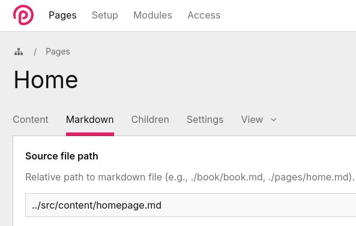

# MarkdownToFields, DOCS

MarkdownToFields parses structured Markdown into a ProcessWire-style content API and syncs frontmatter to page fields.
For a more detailed explanation, check the [readme](../README.md)

## Why use this?

Let me be straight with you: I’m not going to try to convince you to switch to a Markdown-driven content experience, or explain why this it’s “better”. 

Before this module, I had zero experience with the whole “markdown as a CMS” world. But as a solo developer, I have some projects where I’m kind of the designer, developer, webmaster, and editor. And for those, having all the content living in text files, felt like something I wanted to try.

The module born because I was working on a website in 5 languages where each page could have at least 10 different blocks with different layouts, and I didn't want to be jumping to pages, fields, languages tabs to update the content.

So, if you have a website with heavy text layouts, lots of content blocks, multilanguage or even a very simple blog, the versatility of using a single text file to write and structure all the content of a page, plus the ability to tag it in a way that lets you extract exactly what you need, just feels… good.

Also, markdown lives well in git.
You can diff it, review it, move it, generate it, sync it.

Promotional message: Check out MarkdownSync, a companion module that lets you commit content changes made in the ProcessWire backend straight to GitHub. Edit content, commit, done. Your repo stays in sync with production, which feels oddly satisfying. Yei.

## Concepts

These are the few concepts you need to understand to get the module aha moment:

### Content file

The content is just your average joe markdown file *with a little help from my friends*, the `content tags`. These tags let us mark segments of the content, giving it structure that actually matches the layout we want to show on the frontend.

Check this simple example:

```
---
title: The Urban Farm Studio.
---

<!-- section:hero -->

<!-- title -->
# The Urban Farm

<!-- intro... -->
We grow food and ideas in the city.  
From rooftop gardens to indoor farms, we craft systems that actually produce.

We work where soil, design, and tech collide.

<!-- section:columns -->

<!-- sub:left -->
### What we grow


- Leafy greens  
- Microgreens and herbs  
- Small fruit plants  
- Mushrooms and sprouts  

<!-- sub:right -->
### How we work

- Quick planting cycles  
- Minimal waste, maximal yield  
- Transparent tracking  
- Systems that last  


<!-- section:body -->

## Forget industrial farms *and rigid layouts*. 

We help teams own their food systems and iterate fast.  

Our approach is simple:

- Modular growing setups  
- Tools that fit your city space  
- Everything tracked and measurable  
- Systems that scale without chaos  

Every plot starts small. Every harvest **stays predictable**.
```

So the only extra work you really do is sprinkling tags where they actually make sense for your layout.
In `<!-- section:hero -->` I tagged `<!-- title -->` and `<!-- intro -->` because I want direct access to them
($content->hero->title->text, $content->hero->intro->html).

In `<!-- section:body -->` I didn’t tag anything on purpose. For that part of the page, grabbing the whole thing as HTML was enough
($content->body->html).

You tag what you need, skip what you don’t. The structure follows the layout, not the other way around.

### Content tags

We have a few but useful tags. Check the [content tags reference](#) to learn more in detail.

- Section: a top-level container defined with `<!-- section:name -->`.
- Subsection: a nested container `<!-- sub:name -->` inside a section.
- Block: a unit created from headings (#, ##, ...). Blocks may contain extracted elements (lists, paragraphs, images) and children.
  - Orphan / pre-heading block: any content before a section's first heading; its `heading` can be `null`.
- Child block: a sub-block inside a parent block (heading hierarchy).
- Field: `<!-- name -->` (single-block) which *tags* the next element.
- Container: `<!-- name... -->` + `<!-- / -->` captures multiple blocks.

Use sections to organize, fields to tag, and blocks to give structure and extracted items.

## Getting started

### Installation

Bla bla

### Setting up the content

By default the module will look for your markdown files in `site/content/`.
Markdown Files are mapped per **page** and each page uses its page name by default (for example, `about` → `about.md`).

Example (per-page files):
```
site
├── templates
├── content
│   ├── about.md      # used by page name 'about'
│   ├── home.md       # used by page name 'home'
│   └── services.md   # used by page name 'services'
```

#### Custom content folder

You can totally change the `content folder` (where your markdown files are stored) using the config setting `sourcePath` in your `site/config.php` file.

For example, to use `site/templates/markdown` you can do:

```
$config->MarkdownToFields = [
  'sourcePath' => 'templates/markdown/',
];

```

`site/` is used as the root by default, but you’re not limited to it. You can point outside the site folder if you want. For example, `../src/content` will resolve to:

```
site
├── templates
src
└── content
    └── about.md
```

It’s obvious, but worth to mention it.


#### Custom content source


The module uses `contentSource()` to get your markdown files, and by default uses `$page->name . '.md'` (e.g. `about.md` for page `about`). If you want something different, you can override the value in your Page Class:

```php
class AboutPage extends DefaultPage {
  public function contentSource(): string {
    return 'src/about/us/theaboutpage.md';
  }
}
```


Or, if multiple pages use the same template:

```php
class AboutPage extends DefaultPage {
  public function contentSource(): string {
    return 'src/about/' . $this->name . '.md';
  }
}
```

Logic, names, and folder structure are totally up to you.


Also, you can just update the path in the backend using the `md_markdown_source` field.




---


### Getting the content

Finally, the funny part! Once you have your markdown file, you can access the content from any template using `$page->content()` 

Example of template `home.php`:

```php
<?php namespace ProcessWire;
  $content = $page->content();
?>

<section class="hero">
  <h1><?= $content->hero->title->text ?></h1>
  <?= $content->hero->intro->html ?>
</section>

<section class="columns">
  <?= $content->columns->left->html ?>
  <?= $content->columns->right->html ?>
</section>

<section class="body">
  <?= $content->body->html ?>
</section>
```


### Content tags

#### Sections

Sections are top-level containers defined with `<!-- section:name -->`.
They group related content until the next section marker (or end of file).
Sections are independent content areas you can render or sync separately.

Example
```markdown
<!-- section:hello -->
# Hello
Intro text for hello section.

## Hello foo
- One foo
- One bar

<!-- section:bye -->
# Bye
Short bye text.
```
Access:
```php
<?php namespace ProcessWire;
  $content = $page->content();
?>

$hello = $content->hello;
$bye = $content->bye;
```

If content appears **before the first section tag**, it is collected into an **orphan section**.
This orphan section has no name and is accessible by index.


```markdown
# No tag here
Intro text for the section.

<!-- section:bye -->
# Tagged section here
Short text.
``

### Subsections

Subsections `<!-- sub:name -->` are nested containers, or sublevels, inside a section. A subsection captures all content until the next subsection marker or the end of the current section.

Example:
```markdown
<!-- section:columns -->
# Our Team

<!-- sub:left -->
### Jane Doe
Jane is our lead horticulturist with 10+ years of experience in urban farming. 


<!-- sub:right -->

### John Smith
John manages our technology and automation.

- IoT sensor integration
- Automated watering
- Data-driven crop planning

Always ready to help troubleshoot or optimize a setup!
```

Access:
```php
<?php namespace ProcessWire;
  $content = $page->content();
?>

$jane = $content->columns->left->html;
$john = $content->columns->right->html;
```


### Blocks & children

Blocks and children are **not tagged**. They are generated automatically from headings (`#` to `######`).

Each heading starts a **block**.

- A higher-level heading becomes a **parent block**
- Lower-level headings under it become **child blocks**

Every block holds:
- `text` and `html`
- extracted elements like images, lists, links, paragraphs

You can think of it as the heading hierarchy turned into a tree.

---

Example

```markdown
<!-- section:about -->
# About Us
Welcome to our studio! We create digital experiences for modern brands.

## Our Services
- Web design
- App development
- Content strategy


# What We Value

## Collaboration
We believe great work comes from working together.

### Innovation together
- Always learning
- Embracing new tech
````

This produces **two top-level blocks** inside the `about` section:

* `# About Us`
* `# What We Value`

---

#### Accessing blocks

```php
$content = $page->content();
$blocks = $content->about->blocks;
```

You can also access blocks by index, without using the section name:

```php
$content = $page->content();
$blocks = $content->section[0]->blocks;
```

#### Children blocks

Blocks can contain children when the heading level increases.

```php
$content = $page->content();
$values = $content->about->blocks[1];          // # What We Value
$collaboration = $values->children[0];         // ## Collaboration
$innovation = $collaboration->children[0];     // ### Innovation together
```

### Fields & containers

Fields tags specific elements for direct access.
- Regular field: `<!-- name -->` captures a single block (stops at first blank line).
- Container field: `<!-- name... -->` collects multiple blocks until `<!-- / -->` (or named closer).

They are similar bu theres a important disctintion. Look at this example

Example
```markdown
<!-- title -->
# Hello

<!-- summary -->
Paragraph one.

Paragraph two.

Paragraph three.
```

```php
$content = $page->content();
```


HERE I AM!


Access: `$content->hello->title->text`, `$content->hello->summary->text`.

```php
$title = $content->about->blocks[1];          // # What We Value
$collaboration = $values->children[0];         // ## Collaboration
$innovation = $collaboration->children[0];     // ### Innovation together
```


Rules: first occurrence wins within a section; container fields preserve block structure.

### Frontmatter

Frontmatter is an optional `---` YAML-like block at the top of the file. It's used for metadata (title, name, summary). The parser converts simple K/V pairs to arrays; raw content is also available.

Example
```markdown
---
title: The Urban Farm Studio.
---
```
Access: `$content->getFrontmatter()` and `$content->getFrontmatterRaw()`.

Note: mapping frontmatter keys to ProcessWire page fields is configurable; changing the page `name` requires a module sync to update routing.

---

## How to access content

### Semantic (recommended — stable)

```php
// explicit (works)
$title = $content->section('hero')->field('title')->text;
// preferred: magic shorthand
echo $content->hero->title->html;
```

### Positional (for loops)

```php
$section = $content->sections[0];
$block = $section->blocks[0];
echo $block->children[0]->text;
```

### Convenience
- `content->section($nameOrIndex)` accepts a string name or numeric index.
- `content->section[0]` is an alias for indexed access.

Tip: prefer semantic access — it survives edits.

---

## Blocks & extracted elements

Block properties:
- `heading` (HeadingElement) — use `->text` or `->html`
- `level` (1..6 or `null`)
- `html`, `text`, `markdown`
- `children` (nested blocks)

Element collections (each is a ContentElementCollection):
- `images`, `links`, `lists`, `paragraphs`
- Collections support `->html` and `->text` for aggregated output

Example:
```php
$first = $content->sections[0]->blocks[0];
echo $first->heading->text;
foreach ($first->images as $img) echo $img->src;
```

---

## Fields & containers

Regular field (`<!-- name -->`)
- Captures the following block (stops at the first blank line).

Container field (`<!-- name... -->`)
- Captures multiple blocks until `<!-- / -->` or a named closer.

FieldData provides:
- `text`, `html`, `markdown`, `type` and `items()` (for multi items)

Rules:
- **First occurrence wins** per section (no automatic merging).
- Leading markers before the first heading attach to the first block only when the pre-heading contains only markers (convenience behavior).

Example:
```markdown
<!-- title -->
# Hello

<!-- summary... -->
Para 1

Para 2
<!-- / -->
```

```php
echo $content->intro->title->text;
echo $content->intro->summary->text;
```

---

## Frontmatter & syncing

- YAML-like frontmatter at top (`---` block) is parsed when simple K/V pairs are found.
- API: `$content->getFrontmatter()` and `$content->getFrontmatterRaw()`.
- Module maps frontmatter keys to page fields (configurable) in `MarkdownContent::getMarkdownSyncMap()`.
- Changes in markdown frontmatter are synced to page fields when you edit the raw markdown field (`md_markdown`) in the backend and save—the values from the markdown always win.
- Changing a page `name` (slug/url) in frontmatter requires re-sync/module refresh to update the page routing.

Tip: use frontmatter for metadata (title, summary, tags), not block content.

**Adding more frontmatter fields:** By default, `title` and `name` are synced. To add more (e.g., `description`, `summary`), extend the `frontmatter` array in your page class's `MarkdownContent::getMarkdownSyncMap()`:

```php
'frontmatter' => [
  'title' => 'title',
  'name' => 'name',
  'description' => 'description',  // Add custom mappings
  'summary' => 'summary',
],
```

Now frontmatter keys are synced to the corresponding page fields.

---

## Multilanguage

- Put content per-locale, e.g. `content/en/about.md`, `content/it/about.md`.
- Module loads language-specific file; API is the same per language.
- Use `MarkdownFileIO::loadMarkdown($page, $language)` to load language-aware content.

---

## API & helpers (quick list)

- `LetMeDown::load(path): ContentData` — parse a file
- `MarkdownFileIO::loadMarkdown(Page $page, ?string $lang): ?ContentData`
- `MarkdownSyncEngine::syncToMarkdown(Page $page, ?string $lang)`

ContentData
- `.text`, `.html`, `.markdown`
- `.sections` — ordered numeric array (use for iteration)
- `.sectionsByName` — named lookup (first occurrence wins)
- `section(string|int $nameOrIndex): ?Section` — returns Section by name or index
- magic property: `$content->hero`

Section
- `field('name')`, `subsection('name')`, `getRealBlocks()`

Block
- `heading`, `level`, `html`, `text`, `markdown`, `children`, `field(name)`

FieldData
- `text`, `html`, `markdown`, `type`, `items()`

ContentElementCollection
- aggregated `->html` and `->text` helpers

Note: prefer `section('name')` or magic property for named access rather than indexing into `sections` by name.

---

## Tiny examples

Title + description
```markdown
<!-- section:intro -->
<!-- title -->
# Welcome

<!-- description -->
A short intro paragraph.
```
```php
echo $content->intro->title->text;
echo $content->intro->description->html;
```

Container example
```markdown
<!-- notes... -->
One.

Two.
<!-- / -->
```
```php
echo $content->section('foo')->field('notes')->text;
```

Frontmatter
```markdown
---
title: New title
---
```
Change frontmatter and run sync to update the page data.


# config

$config->MarkdownToFields = [
  'htmlField' => 'md_editor',           // Editor field (TinyMCE)
  'markdownField' => 'md_markdown',     // Raw markdown content
  'hashField' => 'md_markdown_hash',    // Sync state tracker
  'sourcePageField' => 'md_markdown_source', // File reference
  'sourcePath' => 'content/',           // Base path for markdown files (relative to site/)
  'debug' => true,                      // Enable debug logging
];
---

## Best practices (short)

- Use semantic access: `section('name')` or `$content->name`.
- Use container fields for multi-paragraph data.
- Keep field names unique per section.
- Put field markers where you expect them (after heading for block attachment) or use marker-only pre-heading to attach.
- Compare `->text` for content checks to avoid HTML-entity differences.

### Locking raw markdown edits 🔒
You can enable a transient **Markdown editor** mode for a single save using the *Markdown editor* checkbox on the Markdown tab. When checked for a save, the raw `md_markdown` field is treated as authoritative for that save only (posted markdown will be written to disk and take priority over editor fields). The toggle is **transient** — it applies only to the current save and is not persisted on the page.

---

## Troubleshooting quick

- Null heading? → pre-heading/orphan block exists before first heading.
- Marker not attached? → check pre-heading contains only markers (otherwise becomes orphan).
- Need to update page URL/name? → change frontmatter + run module sync.

---

## Migration notes

- `sections` is now a deduplicated numeric list — `count($content->sections)` matches logical sections.
- Use `section('name')` or magic `$content->name` instead of `$content->sections['name']`.
- Search and replace occurrences of `sections['` when migrating.

---

## References

- Parsing internals: LetMeDown README (`LetMeDown/readme.md`)
- Examples: `LetMeDown/scripts/` and `examples/` folders

---

If you want I can add a small `docs/sidebar.md` and a single index page for the module UI. Want that?