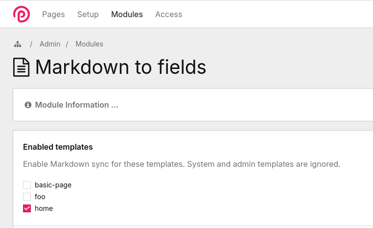
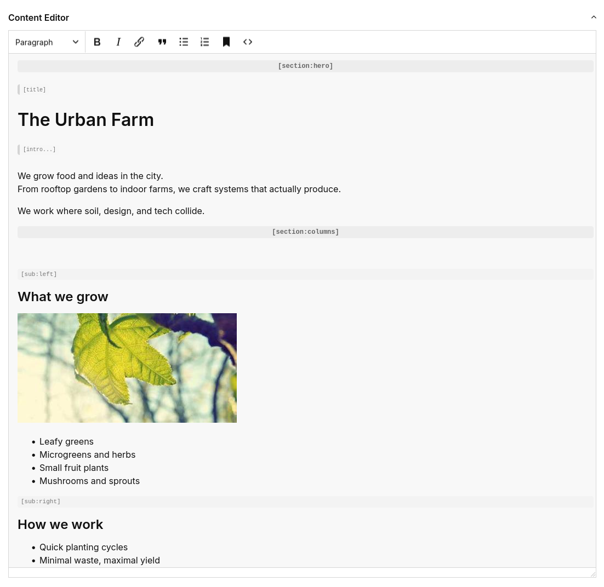
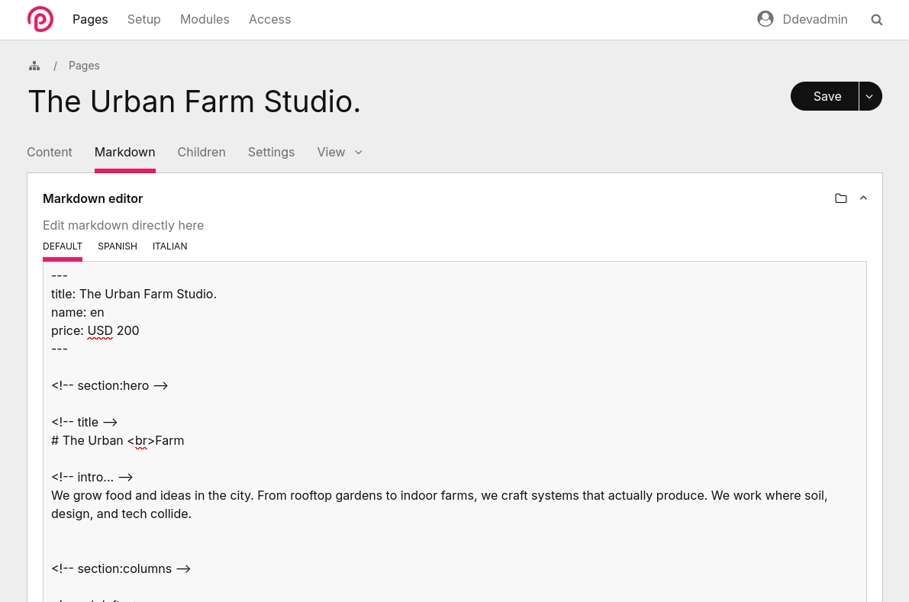

# The MarkdownToFields survival guide. V1.0

Use markdown as your content. Structure it with simple tags, and enjoy the markdown <-> ProcessWire fields sync. That’s MarkdownToFields.
For a more detailed explanation, check the [readme](../README.md)

## Why use this?

I’m not going to try to convince you to switch to a Markdown-driven content experience, or explain why this it’s “better”.

Before this module, I had zero experience with the whole “markdown / Flat-CMS” world. But! when I was working on a website in 5 languages where each page had 10 different blocks with different layouts, I was sure I didn't want to be jumping 'pages/fields/languages/tabs' to update the content.

And, Having all living in text files, felt like something I wanted to try.

So, if you have a website with heavy text layouts, lots of content blocks, multilanguage; the versatility of using a single text file to **write** and **structure** content to make it semantic for your frontend, just feels… good.

Also, markdown lives well in git. You can diff it, review it, move it, generate it, sync it.


## Concepts

These are the few concepts you need to understand to get the module aha moment:

### The markdown file

The content is just an *average Joe* markdown file _with a little help from my friends_, the `content tags`, which allow you to `mark` segments of the content, giving it structure that actually matches the layout you want to show on the front-end.

Check this simple example and pay attention to the `<!-- tags -->`. 
The content indentation is *unnecessary*, it's just to highlight the tags.


<a id="fig-markdown-example"></a> **FIG 1:** Markdown example

```markdown
---
title: The Urban Farm Studio.
---

<!-- section:hero -->

<!-- title -->
  # The Urban Farm

<!-- intro... -->
  We grow food and ideas in the city.
  From rooftop gardens to indoor farms, we craft systems that actually produce.

  We work where soil, design, and tech collide.

<!-- section:columns -->

<!-- sub:left -->
  ### What we grow

  

  - Leafy greens
  - Microgreens and herbs
  - Small fruit plants
  - Mushrooms and sprouts

<!-- sub:right -->
  ### How we work

  - Quick planting cycles
  - Minimal waste, maximal yield
  - Transparent tracking
  - Systems that last

  

<!-- section:body -->

  ## Forget industrial farms *and rigid layouts*.

<!-- field:teams -->
  We had help more than *500* companies across the world.

  Our approach is simple:

  - Modular growing setups
  - Tools that fit your city space
  - Everything tracked and measurable
  - Systems that scale without chaos

  Every plot starts small. Every harvest **stays predictable**.
```

The only extra work you really do is sprinkling tags where they actually make sense for your layout.

In `<!-- section:hero -->` I tagged `<!-- title -->` and `<!-- intro -->` because I want direct access to them
($content->hero->title->text, $content->hero->intro->html).

In `<!-- section:body -->` I didn’t tag anything on purpose, because grabbing the whole thing as HTML is enough for my layout
($content->body->html).

You tag what you need, skip what you don’t. The structure follows the layout, not the other way around.

### What are the Content tags?

The module treats markdown with a few basic premises:

- Markdown is THE content: a *title* must be the title, not a placeholder.
- Markdown stays readable while tags remain invisible.
- The syntax is strictly to *tag* data. This isn’t an alternative template system.

So what we call “content tags” are just simple HTML comments to tame the tree structure your way:

**Sections** – your main content areas  
- Section: a top-level container defined with `<!-- section:name -->`.
- Subsection: a nested container `<!-- sub:name -->` inside a section.

**Blocks** – document units created from headings  
- Block: a unit created from headings (`#`, `##`, …). Blocks may contain extracted elements (lists, paragraphs, images) and children.
  - Orphan blocks: content before a section’s first heading; `heading` can be `null`.
- Child block: a sub-block inside a parent block (heading hierarchy).

**Fields** – labels to tag elements with layout-friendly names  
- Tag: `<!-- name -->` tags the next element.
- Container: `<!-- name... -->` + `<!-- / -->` captures blocks between them.
- Binder: `<!-- field:name -->` syncs a single value between markdown, frontmatter, and a ProcessWire field.

Use **Sections** to organize, **Fields** to tag specific parts, and **Blocks** to access the tree structure. Thats it.

You can learn in more detail how to use them in the [content tags](#content-tags) section. 

### Structure overview

- section  
  - sub  
    - block  
      - elements: paragraphs, images, links, lists  
      - children (nested blocks)  
  - fields: containers, tags, binder  


## Installation

Choose [your favorite way](https://modules.processwire.com/install-uninstall/) to install the module in Processwire.

## Getting started

Using the module boils down to three simple steps:

1. [Create a markdown](#setting-up-the-content) file for your page
2. [Tag your content](#getting-the-content) with [content tags](#content-tags)
3. Extract and render it in your templates

### Setting up the content

Usually in ProcessWire you start by creating a template, add some fields, and then create pages based on that template. With MarkdownToFields the process is the same, but before you jump to create fields to store the content, there’s a huge probability you no longer need them, because markdown will be the source of your content. Which means you’ll have to create a Markdown file for each page. 

Those markdown files are mapped per **ProcessWire page** using the `page name` (for example, `about` → `about.md`), and the module will look for them by default in the `site/content/` folder.

<a id="fig-markdown-files-per-page"></a> **FIG 2:** Markdown files per page

```
site
├── templates
├── content
│   ├── about.md      # used by page name 'about'
│   ├── home.md       # used by page name 'home'
│   └── services.md   # used by page name 'services'
```

You can add content files at any time, even empty ones.

#### Enabling MarkdowntoFields in your templates

By default when installed, the template doesn’t know in which templates you want to use it. You have to enable them. Go to the module settings and check the templates of the pages you want to use markdown as the source of content.

<a id="fig-enable-templates-checkboxes"></a> **FIG 3:** Enabling the module for your templates using the "Enabled Templates" checkboxes



By doing this, the module will add a textarea field you can use to edit the content, and a markdown tab you can use to edit athe raw markdown.

<a id="fig-content-editor-backend"></a> **FIG 4:** Content editor in your page Backend



Also, if you uncheck a template, the fields to edit the content and the markdown will be removed. But don’t worry, you won’t lose any content. Remember, your source of truth is the markdown file. Nice.

<a id="fig-markdown-editor-tab"></a> **FIG 5:** Markdown editor tab



#### Automatic generation of markdown files

When you create a `Page` whose template is enabled in the [Enable Templates config section](#fig-enable-templates-checkboxes), the module automatically creates a `pagename.md` file if it doesn’t exist.

Once the file is created, it becomes the main source for future syncs. From that point on, the markdown file drives the content.


#### Custom content folder

You can change the `content folder` (where your markdown files are stored) using the [config setting](#config-reference) `sourcePath` in your `site/config.php` file.

For example, to use `site/templates/markdown` you can do:

<a id="fig-custom-content-folder-source-path"></a> **FIG 6:** Custom content folder source path

```
$config->MarkdownToFields = [
  'sourcePath' => 'templates/markdown/',
];

```

`site/` is used as the root by default, but you’re not limited to it. You can point outside the site folder if you want. For example, `../src/content` will resolve to:

<a id="fig-path-outside-site-folder"></a> **FIG 7:** Path outside site folder

```
site
├── templates
src
└── content
    └── about.md
```

It’s obvious, but worth to mention it.

#### Custom content source

The module uses `contentSource()` to get your markdown files, and by default uses `$page->name . '.md'` (e.g. `about.md` for page `about`). If you want something different, you can override the value in your Page Class:

<a id="fig-customizing-content-file-path-page-class"></a> **FIG 8:** Customizing the content file path in a Page Class

```php
class AboutPage extends DefaultPage {

  public function contentSource(): string {
    return 'src/about/us/theaboutpage.md';
  }

}
```

Or, if multiple pages use the same template:

<a id="fig-dynamic-content-path-based-on-page-name"></a> **FIG 9:** Dynamic content file path based on page name

```php
class AboutPage extends DefaultPage {

 public function contentSource(): string {
    return 'src/about/' . $this->name . '.md';
  }

}
```

Logic, names, and folder structure are totally up to you.


### Getting the content

Finally, the fun part!  

Once you have a markdown file, a template, and a page, the next step is to access the Markdown content to display it on the frontend. To let your templates access that content, you need to add the `MarkdownContent` trait to your [default PageClass ➚](https://processwire.com/blog/posts/pw-3.0.152/#new-ability-to-specify-custom-page-classes).

This trait adds the `content()` method to your Page class, so any template that extends `DefaultPage` can read markdown content using `$page->content()`.

<a id="fig-accessing-content-of-this-markdown"></a> **FIG 10:** Accessing the content of [this markdown](#fig-markdown-example)

/site/classes/DefaultPage.php
```php
<?php

namespace ProcessWire;

class DefaultPage extends Page {
  use MarkdownContent;
}

```

  /site/classes/HomePage.php
```php
<?php

namespace ProcessWire;

class HomePage extends DefaultPage {
}
```

/site/templates/home.php
```php
<?php namespace ProcessWire;
  $content = $page->content();
?>

<section class="hero">
  <h1><?= $content->hero->title->text ?></h1>
  <?= $content->hero->intro->html ?>
</section>

<section class="columns">
  <?= $content->columns->left->html ?>
  <?= $content->columns->right->html ?>
</section>

<section class="body">
  <?= $content->body->html ?>
</section>
```

And that’s it! Now, the next step is to understand how to use the [content tags](#content-tags). (This link will move you just 2 lines below. It’s also known as the laziest link in markdown history ever.)

## Content tags

“Content tags” are markers you can add to make it easy to structure your document’s content. Imagine that, in your frontend, you’re planning to have a *hero* banner with a *title* and a *description*, and then a *body* section with some *content* and an *aside*:

- hero
  - title
  - description
- body
  - content
  - aside

It makes sense to tag your content in a way that matchs your layout, for example:

```markdown
<!-- section:hero -->
  <!-- title -->
  <!-- description -->

<!-- section:body -->
  <!-- sub:content -->
  <!-- sub:aside -->
```

You only need to figure out which content tag best represents the structure you’re looking for.

#### Sections

Sections are top-level containers defined with `<!-- section:name -->`.  
They group related content and can be rendered independently.

Each section is represented by a `Section` object with these properties:

| Property      | Type   | Description                                                         |
| ------------- | ------ | ------------------------------------------------------------------- |
| `html`        | string | Rendered HTML of the section’s main content (no subsections)        |
| `text`        | string | Plain text version of the main content                              |
| `markdown`    | string | Raw markdown up to the next section marker                          |
| `blocks`      | array  | Parsed block objects from the main content                          |
| `fields`      | array  | Named field blocks defined with `<!-- field:name -->`               |
| `subsections` | array  | Nested `Section` objects defined with `<!-- sub:name -->`           |

<a id="fig-markdown-with-two-sections"></a> **FIG 11:** Markdown with two sections

```markdown
<!-- section:hello -->

# Hello

Intro text for hello section.

## Hello foo

- One foo
- One bar

<!-- section:bye -->

# Bye

Short bye text.
```

<a id="fig-rendering-sections"></a> **FIG 12:** Rendering sections

```php
<?php namespace ProcessWire;
  $content = $page->content();
  
  $hello = $content->hello;
  $bye = $content->bye;
?>
```

##### Orphan sections

If content appears **before the first section tag**, it is collected into an **orphan section**.
This orphan section has no name and is accessible by index.

<a id="fig-content-without-section"></a> **FIG 13:** Content without a section

```markdown
# No content tag before this title

Intro text outside any section.

<!-- section:bye -->

# Tagged section here

Short text.
```

<a id="fig-rendering-orphan-section"></a> **FIG 14:** Rendering an orphan section

```php
<?php namespace ProcessWire;
  $content = $page->content();
  
  $orphan = $content->sections[0];
?>
```

##### Section object

The section object also gives you access to any block field of subsection inside. For example if we add an `<!-- intro -->` [tag field](#field-tags) and a `<!-- sub:foo -->` [subsection](#subsections) to the `<!-- section:hello -->`:

<a id="fig-section-with-tag-field-subsection"></a> **FIG 15:** Section with a tag field and a subsection

```markdown
<!-- section:hello -->

# Hello

<!-- intro -->
Intro text for hello section.

<!-- sub:foo -->
## Hello foo

- One foo
- One bar
```

The section object exposes them like this

```
LetMeDown\Section
  html: '
    <h1>Hello</h1>
    <p>Intro text for hello section.</p>'
  text: '
    Hello
    Intro text for hello section.'
  markdown:'
    # Hello 
    <!-- intro -->
    Intro text for hello section.'
  blocks: 
    0 => LetMeDown\Block
  fields: 
    'intro' => LetMeDown\FieldData
  subsections: 
    'foo' => LetMeDown\Section
```


#### Subsections

Subsections `<!-- sub:name -->` are nested containers, or sublevels, inside a section.
A `subsection` captures all content until the next `subsection` or `section` tag appears.

Example:

<a id="fig-content-with-subsections"></a> **FIG 16:** Content with subsections

```markdown
<!-- section:columns -->

# Our Team

<!-- sub:left -->

### Jane Doe

Jane is our lead horticulturist with 10+ years of experience in urban farming.


<!-- sub:right -->

### John Smith

John manages our technology and automation.

- IoT sensor integration
- Automated watering
- Data-driven crop planning

Always ready to help troubleshoot or optimize a setup!
```

<a id="fig-rendering-html-subsections"></a> **FIG 17:** Rendering HTML of subsections

```php
<?php namespace ProcessWire;
  $content = $page->content();
  
  $jane = $content->columns->left;
  $john = $content->columns->right;
?>
```

Subsections are returned as `Section` objects with the same core properties:

| Property      | Type   | Description                                  |
| ------------- | ------ | -------------------------------------------- |
| `html`        | string | Rendered HTML of the subsection content      |
| `text`        | string | Plain text version of the subsection content |
| `markdown`    | string | Raw markdown of the subsection               |
| `blocks`      | array  | Parsed block objects inside the subsection   |
| `fields`      | array  | Named field blocks inside the subsection     |
| `subsections` | array  | Subsections do not support nested subsections|

<a id="fig-section-object-columns-left"></a> **FIG 18:** Example of section object for `$jane` aka: `$page->content()->columns->left`

```php
LetMeDown\Section
  html: 
    '<h3>Jane Doe</h3>
    <p>Jane is our lead horticulturist with 10+ years of experience in urban farming.</p>
    <p></p>'
  text: 
    'Jane Doe
    Jane is our lead horticulturist with 10+ years of experience in urban farming.'
  markdown: 
    '### Jane Doe
    Jane is our lead horticulturist with 10+ years of experience in urban farming.
    '
  blocks: 
    0 => LetMeDown\Block
  fields: array (0)
  subsections: array (0)
```


#### Blocks & children

Blocks and children are not something you tag. They are generated automatically from headings (`#` to `######`).

Each heading starts a **block**.

- A higher-level heading becomes a **parent block**
- Lower-level headings under it become **child blocks**

<a id="fig-content-with-blocks-and-children"></a> **FIG 19:** Content example with blocks and childs

```markdown
<!-- section:about -->

# About Us

Welcome to our studio! We create digital experiences for modern brands.

## Our Services

- Web design
- App development
- Content strategy


# What We Value

## Collaboration

We believe great work comes from working together.

### Innovation together

- Always learning
- Embracing new tech
```

This produces **two top-level blocks** inside the `about` section:

- `# About Us`
- `# What We Value`


To access them you can use:

<a id="fig-getting-blocks-of-section"></a> **FIG 20:** Getting the blocks of a section

```php
<?php namespace ProcessWire;
  $content = $page->content();
  
  $blocks = $content->about->blocks;
  $about = $blocks[0];
  $value = $blocks[1];
?>
```

Or, you can also access blocks by index:

<a id="fig-getting-section-blocks-by-index"></a> **FIG 21:** Getting section and blocks by index

```php
<?php namespace ProcessWire;
  $content = $page->content();
  
  $blocks = $content->section[0]->blocks;

  $about = $blocks[0];
  $value = $blocks[1];
?>
```

##### Block properties

| Property     | Type                       | Description                                                    |
| ------------ | -------------------------- | -------------------------------------------------------------- |
| `heading`    | `HeadingElement`           | The block’s heading object (text, html, level)                 |
| `html`       | string                     | Full rendered HTML of the block (heading + content + children) |
| `text`       | string                     | Plain text version of the block                                |
| `markdown`   | string                     | Raw markdown for the block                                     |
| `content`    | string                     | HTML content of the block (without the heading)                |
| `paragraphs` | `ContentElementCollection` | All paragraph elements inside the block                        |
| `images`     | `ContentElementCollection` | All images inside the block                                    |
| `links`      | `ContentElementCollection` | All links inside the block                                     |
| `lists`      | `ContentElementCollection` | All lists inside the block                                     |
| `children`   | array of `Block`           | Child blocks (subheadings)                                     |


<a id="fig-block-object-about"></a> **FIG 22:** Output of Block object `$about` from the markdown in [Content example with blocks and childs](#fig-content-with-blocks-and-children) 


```php
LetMeDown\Block
  heading:
    LetMeDown\HeadingElement
      text: 'About Us'
      innerHtml: 'About Us'
      html: '<h1>About Us</h1>'
      level: 1
  content:
    '<p>Welcome to our studio! We create digital experiences for modern brands.</p>'
  html:
    '<h1>About Us</h1>
     <p>Welcome to our studio! We create digital experiences for modern brands.</p>
     <h2>Our Services</h2>
     <ul>
       <li>Web design</li>
       <li>App development</li>
     </ul>'
  text:
    'About Us
     Welcome to our studio! We create digital experiences for modern brands.
     Our Services
     Web design
     App development'
  markdown:
    '# About Us
     Welcome to our studio! We create digital experiences for modern brands.
     ## Our Services
     - Web design
     - App development'
  paragraphs: LetMeDown\ContentElementCollection (1)
  images: LetMeDown\ContentElementCollection (0)
  links: LetMeDown\ContentElementCollection (0)
  lists: LetMeDown\ContentElementCollection (0)
  children:
    0 => LetMeDown\Block
```


##### Children blocks

Any heading under another becomes a child block.  
The hierarchy follows your markdown structure, giving you a tree of blocks you can traverse.

<a id="fig-accessing-block-children"></a> **FIG 23:** Accessing block children and sub-children

```php
<?php namespace ProcessWire;
  $content = $page->content();
  
  $values = $content->about->blocks[1];       // # What We Value (h1)
  $collaboration = $values->children[0];      // ## Collaboration (h2)
  $innovation = $collaboration->children[0]; // ### Innovation together (h3)
?>
```

#### Elements

One of the best parts of blocks is that you can access any list, image, link, or paragraph inside them.
They’re stored as collections, so you can grab *all* images, *all* links, and so on.

Here’s a simple markdown example:

<a id="fig-content-with-lists-images-paragraphs-links"></a> **FIG 24:** Content with lists, images, paragraphs, and links

```markdown
# Digital Studio

Welcome to our studio! We create digital experiences for brands like:

- Ramason
- Emtibi

Feel free to [call us](#), [visit us](#), or [drop us a line](#).

We are based in [Chicago](#), but we also have an office in [NY](#).

- 
- 
```

Each block object contains a `HeadingElement` and the `ContentElementCollection` for lists, images, paragraphs, and links:

<a id="fig-getting-elements-from-block"></a> **FIG 25:** Getting elements from a block

```php
<?php namespace ProcessWire;
  $content = $page->content();

  $block = $content->section[0]->blocks[0];

  $heading = $block->heading;
  $paragraphs = $block->paragraphs;
  $lists = $block->lists;
  $images = $block->images;
  $links = $block->links;
?>
```

You can also drill down to specific elements:

<a id="fig-accessing-specific-elements"></a> **FIG 26:** Accessing specific elements

```php
<?php namespace ProcessWire;
  $content = $page->content();

  $block = $content->section[0]->blocks[0];

  $weare = $block->paragraphs[2]->text;   // "We are based..."
  $chicago = $block->images[0]->src;      // chicago.jpg
  $ramason = $block->lists[0]->items[0];  // Ramason
  $visitus = $block->links[1]->text;      // "visit us"
?>
```

##### Headings

Each block exposes **only one heading**: the first heading found in that block.
This is the main heading that defines the block’s title and level.

| Property    | Type   | Description                                     |
| ----------- | ------ | ----------------------------------------------- |
| `text`      | string | Plain text of the block’s main heading          |
| `innerHtml` | string | Rendered inner HTML of the heading              |
| `html`      | string | Rendered HTML of the heading                    |
| `level`     | int    | Heading level (`1` for `#`, `2` for `##`, etc.) |


<a id="fig-heading-output"></a> **FIG 27:** Output of heading $heading from [Digital Studio markdown example](#fig-content-with-lists-images-paragraphs-links)
```
LetMeDown\HeadingElement
  text: 'Digital Studio'
  innerHtml: '<h1>Digital Studio</h1>'
  html: '<h1>Digital Studio</h1>'
  level: 1
```

##### Paragraphs

Each block exposes a `paragraphs` collection containing every paragraph found in that block, in the same order as the markdown. 
Each paragraph is returned as a `ContentElement` object with both plain text and rendered HTML.

| Property | Type   | Description                               |
|----------|--------|-------------------------------------------|
| `text`   | string | Plain text version of the content         |
| `html`   | string | Rendered HTML output                      |
| `data`   | array  | No extra data                             |


<a id="fig-accessing-paragraphs-markdown-example"></a> **FIG 28:** Accessing paragraphs from the markdown example in [Digital Studio markdown example](#fig-content-with-lists-images-paragraphs-links)

```php
<?php namespace ProcessWire;
  $content = $page->content();

  $paragraphs = $content->section[0]->blocks[0]->paragraphs;
  $first = $paragraphs[1];

  $text = $first->text;
  $html = $first->html;
?>
```

<a id="fig-paragraph-contentelement-example"></a> **FIG 29:** Paragraph `ContentElement` example

```php
LetMeDown\ContentElement
  text: 'Welcome to our studio! We create digital experiences for brands like:'
  html: '<p>Welcome to our studio! We create digital experiences for brands like:</p>'
  data: array (0)
```

##### Lists

Each block exposes a `lists` collection containing every list found in that block, in the same order as in the markdown.
Each list is returned as a `ContentElement` object with its text, rendered HTML, list type, and individual items.

| Property | Type   | Description                            |
| -------- | ------ | -------------------------------------- |
| `text`   | string | Plain text version of the list         |
| `html`   | string | Rendered HTML output (`<ul>` / `<ol>`) |
| `type`   | string | List type (`ul` or `ol`)               |
| `items`  | array  | Individual list items as strings       |
| `data`   | array  | Raw list metadata                      |

<a id="fig-accessing-lists-markdown-example"></a> **FIG 30:** Accessing lists from the [Digital Studio markdown example](#fig-content-with-lists-images-paragraphs-links)

```php
<?php namespace ProcessWire;
  $content = $page->content();

  $block = $content->section[0]->blocks[0];
  $lists = $block->lists;

  $first = $lists[0];

  $text = $first->text;
  $html = $first->html;
  $type = $first->type;
  $items = $first->items;
?>
```

<a id="fig-list-contentelement-example"></a> **FIG 31:** List `ContentElement` example

```php
LetMeDown\ContentElement
  text: '
    Ramason
    Emtibi'
  html: '
    <ul>
      <li>Ramason</li>
      <li>Emtibi</li>
    </ul>'
  data:
    'type' => 'ul'
    'items' => 
      0 => 'Ramason'
      1 => 'Emtibi'
```

##### Links

Each block exposes a `links` collection containing every link found in that block, in the same order as in the markdown.
Each link is returned as a `ContentElement` object with its text, rendered HTML, and destination URL.

| Property | Type   | Description                |
| -------- | ------ | -------------------------- |
| `text`   | string | Link label (plain text)    |
| `html`   | string | Rendered `<a>` HTML output |
| `href`   | string | Link destination URL       |
| `data`   | array  | Raw link metadata          |

<a id="fig-accessing-links-markdown-example"></a> **FIG 32:** Accessing links from the [Digital Studio markdown example](#fig-content-with-lists-images-paragraphs-links)

```php
<?php namespace ProcessWire;
  $content = $page->content();

  $block = $content->section[0]->blocks[0];
  $links = $block->links;

  $first = $links[0];

  $text = $first->text;
  $html = $first->html;
  $href = $first->href;
?>
```

<a id="fig-link-contentelement-example"></a> **FIG 33:** Link `ContentElement` example

```php
LetMeDown\ContentElement
  text: 'call us'
  html: '<a href="#">call us</a>'
  data: 
    'href' => '#'
```

##### Images

> Note: Learn more about how to use images in the [markdown images to Processwire ](#images-markdown--processwire-assets) section.

Images inside a block are collected in the `images` property.
Each entry represents one image tag, giving you access to its label, rendered HTML, source path, and alt text.

| Property | Type      | Description                  |
| -------- | --------- | ---------------------------- |
| `text`   | string    | Image label (from markdown)  |
| `html`   | string    | Rendered `` HTML output |
| `data`   | array     | Raw image metadata           |
| `src`    | string    | Image source path            |
| `alt`    | string    | Alternative text             |
| `img`    | PageImage | ProcessWire Pageimage object |

<a id="fig-accessing-images-markdown-example"></a> **FIG 34:** Accessing images from the [Digital Studio markdown example](#fig-content-with-lists-images-paragraphs-links)

```php
<?php namespace ProcessWire;
  $content = $page->content();

  $block = $content->section[0]->blocks[0];
  $images = $block->images;

  $first = $images[0];

  $text = $first->text;
  $html = $first->html;
  $src  = $first->src;
  $alt  = $first->alt;
  $img  = $first->img; 
?>
```

<a id="fig-image-contentelement-example"></a> **FIG 35:** Image `ContentElement` example

```php
LetMeDown\ContentElement
  text: '[Chicago office]'
  html: ''
  data: 
    'src' => 'chicago.jpg'
    'alt' => 'Chicago office'
    'img' => ProcessWire\Pageimage
```


#### Field tags

Accessing blocks and their elements is powerful, but let’s be honest, writing
`$page->content()->section[0]->blocks[0]->lists[0]->html` just to get a list’s HTML isn’t exactly fun.

That’s where **field tags** shine. You drop a tag before any element, and… you can access it directly by name. Let me show you.

In the [Digital Studio markdown example](#fig-content-with-lists-images-paragraphs-links) let’s add a section tag `<!-- section:intro -->` and tag the lists with `<!-- brands -->` and `<!-- offices -->`:

<a id="fig-content-with-field-tags"></a> **FIG 36:** Content with field tags

```markdown
<!-- section:intro -->
# Digital Studio

Welcome to our studio! We create digital experiences for brands like:

<!-- brands -->
- Ramason
- Emtibi

Feel free to [call us](#), [visit us](#), or [drop us a line](#).

We are based in [Chicago](#), but we also have an office in [NY](#).

<!-- offices -->
- 
- 
```

Now the lists are easy to grab:

<a id="fig-accessing-field-tagged-elements"></a> **FIG 37:** Accessing field-tagged elements

```php
<?php namespace ProcessWire;
  $content = $page->content();

  $brands = $content->intro->brands->html;
  $offices = $content->intro->offices->html;
?>
```

It’s important to understand that **field tags only grab the next element**.

If you place a field tag before multiple paragraphs, you’ll only get the **first** one. That’s because each paragraph is its own element (`<p>`).

But if you place a field tag before a list, you’ll get the **entire list**, not just the first item. That’s because the list itself is a single element (`<ul>`), and the items live inside it.

So what the tag captures depends on what comes right after it.

<a id="fig-field-tags-before-paragraphs-list"></a> **FIG 38:** Field tags before paragraphs and a list

```markdown
# Hello

<!-- intro -->

Paragraph one.

Paragraph two.


<!-- list -->

- Item one
- Item two
```

In this case:

* `intro` returns **only** “Paragraph one.”
* `list` returns the **whole list** with both items.


##### The FieldData object

When you access content **by position** (like `blocks[0]`), you get a `ContentElement`.

When you access content **by field tag** (like `->offices`), you get a `FieldData` object.

`FieldData` is just a nicer wrapper around the same element.

It keeps:

* the original **markdown**
* the rendered **HTML**
* a plain **text** version
* the **type** of element (list, image, paragraph, etc.)
* the parsed **data** (links, images, src, alt, etc.)
* the **field name** you used (`offices`, `intro`, etc.)

Example:

<a id="fig-fielddata-offices"></a> **FIG 39:** FieldData object for the [`offices`](fig-content-with-field-tags) field tag

```php
<?php namespace ProcessWire;
  $content = $page->content();
  
  $offices = $content->section[0]->offices;
?>
```

```php
LetMeDown\FieldData
  name: 'offices'
  markdown: '-  ...'
  html: '<ul>...</ul>'
  text: ''
  type: 'list'
  data: [ ... ]
```

So:

* `ContentElement` = raw parsed element
* `FieldData` = named, structured, easier to use

They refer to the same content, just exposed in different ways. Nice.


#### Field containers


If you want more control over what content you capture, you can use **field containers**.
They collect everything between `<!-- name... -->` and `<!-- / -->`.

Containers also **auto-close** if a new section, subsection, or another field container starts.

<a id="fig-using-field-containers"></a> **FIG 40:** Using field containers

```markdown
<!-- section:hello -->
# Hello

<!-- intro... -->
Paragraph one.

Paragraph two.
<!-- / -->

<!-- description... -->
Paragraph three.

Paragraph four.

<!-- section:bye -->
# Goodbye

Paragraph five.
```

<a id="fig-accessing-container-content"></a> **FIG 41:** Accessing container content

```php
<?php namespace ProcessWire;
  $content = $page->content();

  $intro = $content->hello->intro;        // Paragraph one and two
  $desc  = $content->hello->description; // Paragraph three and four
?>
```

#### Field binders

Sometimes you want a value from frontmatter to appear in your content body, and you want it to stay in sync automatically. That's what field bindings are for.

Use `<!-- field:name -->` followed by emphasized text (`*value*` or `__value__`) to create a binding. When you update the frontmatter value (or the corresponding ProcessWire field), the emphasized text updates automatically in both directions.

<a id="fig-frontmatter-field-binder"></a> **FIG 42:** A value of frontmatter represented in the content using the  field binder

```markdown
---
price: USD 5500
---

# Premium Package

<!-- field:price -->
Our premium package costs *USD 5500*
```

Now if you change `price: USD 6000` in the frontmatter (or edit the `price` field in ProcessWire), the text in the body automatically updates to `*USD 6000*`. No manual find-and-replace needed.

Useful for prices, dates, version numbers, or any value that appears multiple times in your content.

**Note:** If you edit the markdown outside ProcessWire and, for example, change the frontmatter price to
`price: USD 6000`, you’ll need to trigger a [Manual Sync](#manual-syncing-markdown-files-to-processwire) for that change to be reflected in the rendered content (e.g. “Our premium package costs *USD 6000*”).


## Images (Markdown → ProcessWire assets)

In ProcessWire, you usually create an image field, attach it to a template, and upload images there.
With this module, you have an alternative.

You just write images using regular Markdown syntax:

```markdown

```

When a sync occurs, the module looks for that file in the default images folder:

```
site/images/hero.jpg
```

That means:

1. **You need a folder with your source images**, otherwise there’s nothing to sync.
2. When adding images from an external editor, save your content and trigger a
   [manual sync](#manual-syncing-markdown-files-to-processwire)
   (Modules > Refresh) to process those images.

During the sync, the module copies the source images into the page’s asset folder:

```
site/assets/files/{pageId}/
```

From there, ProcessWire serves them normally:

* visible in the editor preview
* available in the frontend
* accessible as `PageImage` objects

The module does **zero image processing**.
It just outputs the original image URL. No variants. No compression. No magic.

If you want resizing, crops, formats, etc., that’s your job.

For that, you can access the actual `ProcessWire\Pageimage` object via the `img` property.

---

<a id="fig-image-with-field-tag"></a> **FIG 43:** Image with field tag

```markdown
---
title: The Urban Farm Studio.
---

<!-- section:hero -->

# Urban farm
We grow food and ideas in the city. 

<!-- farm -->

```

<a id="fig-getting-pageimage-object"></a> **FIG 44:** Getting the `ProcessWire\Pageimage` object

```php
<?php namespace ProcessWire;
  $content = $page->content();
  
  $hero = $content->hero;
  $farm = $hero->farm->img; // ProcessWire\Pageimage
?>
```

Sweet. Isn't it?


### Configuration (in `site/config.php`):

If you want to customize the folder where your source images are, use:

```php
$config->MarkdownToFields = [

  // absolute and relative paths allowed
  // /var/www/html/myimages/
  // myimages/
  // ../../myimages

  'imageSourcePaths' => 'myimages/'
];
```

## Frontmatter

You can use frontmatter to sync ProcessWire fields from markdown.

```markdown
---
title: The Urban Farm Studio.
name: our-studio
---

By default, only the `title` field is synced.
Other fields (like `name`) are supported, but **only if you explicitly include them** with `includeFrontmatterFields`.

If you choose to sync `name`, keep in mind it changes the page URL.
You’ll need to run a [module refresh](#manual-syncing-markdown-files-to-processwire) (`Modules > Refresh`) to update routing.

Frontmatter **does sync automatically** by default.
You can disable it with:

```php
'autoSyncFrontmatter' => false,
```

**Note:**
ProcessWire field support is ~~lame~~ basic for now, and only text-based fields are supported.
We all have to start somewhere, right?


### Multi-Language Support

The module respects ProcessWire's language system:

```
content/
  en/
    about.md    → English content
  it/
    about.md    → Italian content
  de/
    about.md    → German content
```

Same API in templates, different content per language. Language switching happens automatically based on user language.


## Config reference

This config goes in your `config.php` file. It controls how markdown is found, parsed, and synced.

<a id="fig-example-config-file"></a> **FIG 45:** Example config file with all properties

```php
$config->MarkdownToFields = [

  // templates
  'enabledTemplates' => ['home', 'about'],

  // fields
  'htmlField' => 'md_editor',
  'markdownField' => 'md_markdown',
  'hashField' => 'md_markdown_hash',

  // content
  'sourcePath' => 'content/',
  'imageBaseUrl' => $config->urls->files . '{pageId}/',
  'imageSourcePaths' => $config->paths->site . 'images/',

  // frontmatter
  'autoSyncFrontmatter' => true,
  'includeFrontmatterFields' => ['name', 'summary', 'bio'],
  'excludeFrontmatterFields' => ['description'],

  // debug
  'debug' => true,
];
```


- **enabledTemplates**
  Lets you define the active templates in code instead of clicking around in the 'Enable templates' section of modules UI.

- **htmlField**
  Field where rendered HTML is stored (your content editor).

- **markdownField**
  Field where raw markdown is stored (source of truth).

- **hashField**
  Stores a hash for change detection.

- **sourcePath**
  Folder (relative to `site/`) where markdown files live.

- **imageBaseUrl**
  URL prefix for images in markdown.
  `{pageId}` is replaced with the page ID.

- **imageSourcePaths**
  Folders to search for referenced images.

- **autoSyncFrontmatter**
  If `true`, frontmatter keys are synced to page fields.
  If `false`, frontmatter keys are... not synced to page fields.


- **includeFrontmatterFields**
  Extra frontmatter keys to sync.
  Use this for fields like `name` if you *want* markdown to control them.

- **excludeFrontmatterFields**
  Frontmatter keys to ignore.

- **debug**
  Enable debug mode if `true`


## Manual syncing markdown files to ProcessWire

If you change **content only** (text, lists, etc.), you don’t need to do anything special.
Those updates are reflected in the frontend automatically.

But! some changes requires a **sync** to run, for example:

* You changed the page **name** via frontmatter
* You added or modified **field bindings**
* You add a new image which needs to be processed by Processwire

If you are editing your markdown files in an IDE or any tool outside ProcessWire and make one of those changes, ProcessWire won’t detect it on its own. To trigger a sync, go to: **Modules > Refresh** in Processwire admin.

That’s… it.

Fin.