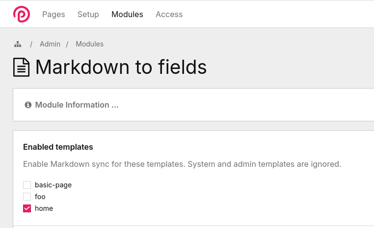
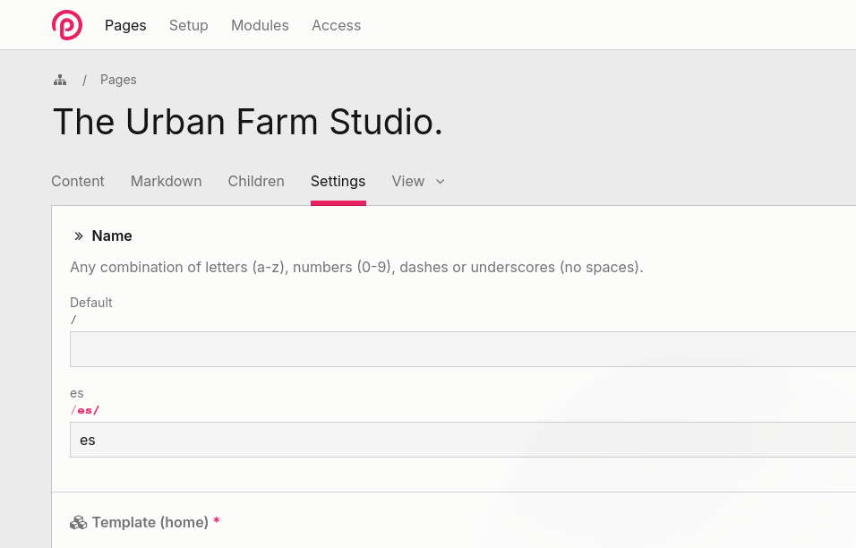
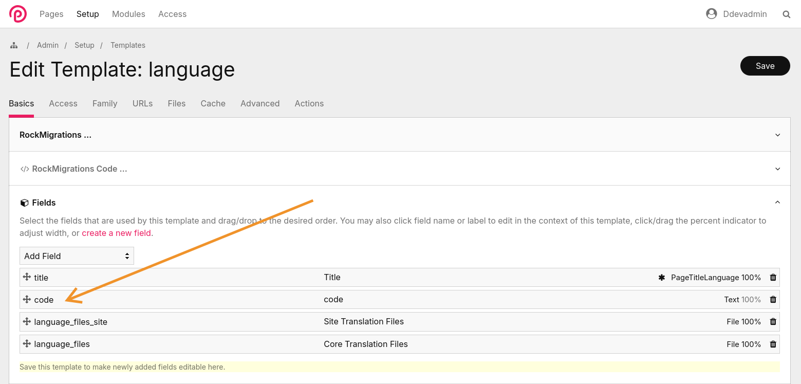
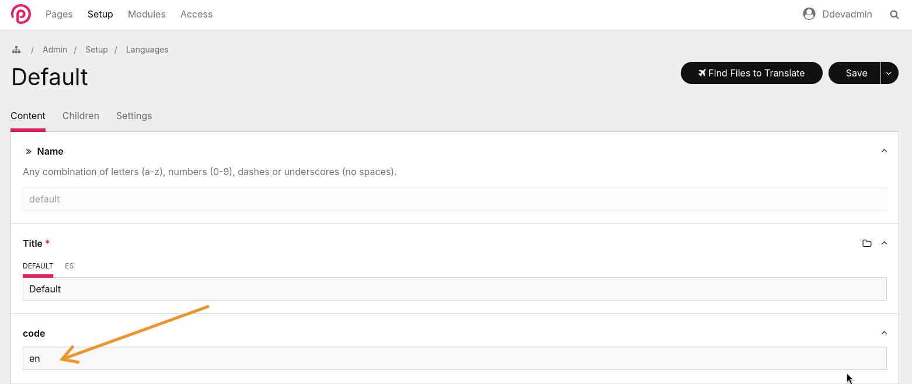

# The MarkdownToFields survival guide. V1.0

Use markdown as your content. Structure it with simple tags, and enjoy the markdown <-> ProcessWire fields sync. That’s MarkdownToFields.

## Why use this?

I’m not going to try to convince you to switch to a Markdown-driven content experience, or explain why this it’s “better”.

Before this module, I had zero experience with the whole “markdown / Flat-CMS” world. But! when I was working on a website in 5 languages where each page had 10 different blocks with different layouts, I was sure I didn't want to be jumping 'pages/fields/languages/tabs' to update the content.

And, Having all living in text files, felt like something I wanted to try.

So, if you have a website with heavy text layouts, lots of content blocks, multilanguage; the versatility of using a single text file to **write** and **structure** content to make it semantic for your frontend, just feels… good.

Also, markdown lives well in git. You can diff it, review it, move it, generate it, sync it.


## Concepts

These are the few concepts you need to understand to get the module aha moment:

### The markdown file

The content is just an *average Joe* markdown file _with a little help from my friends_, the `content tags`, which allow you to `mark` segments of the content, giving it structure that actually matches the layout you want to show on the front-end.

Check this simple example and pay attention to the `<!-- tags -->`. 
The content indentation is *unnecessary*, it's just to highlight the tags.


<a id="fig-markdown-example"></a> **FIG 1:** Markdown example

```markdown
---
title: The Urban Farm Studio.
---

<!-- section:hero -->

<!-- title -->
  # The Urban Farm

<!-- intro... -->
  We grow food and ideas in the city.
  From rooftop gardens to indoor farms, we craft systems that actually produce.

  We work where soil, design, and tech collide.

<!-- section:columns -->

<!-- sub:left -->
  ### What we grow

  

  - Leafy greens
  - Microgreens and herbs
  - Small fruit plants
  - Mushrooms and sprouts

<!-- sub:right -->
  ### How we work

  - Quick planting cycles
  - Minimal waste, maximal yield
  - Transparent tracking
  - Systems that last

  

<!-- section:body -->

  ## Forget industrial farms *and rigid layouts*.

<!-- field:teams -->
  We had help more than *500* companies across the world.

  Our approach is simple:

  - Modular growing setups
  - Tools that fit your city space
  - Everything tracked and measurable
  - Systems that scale without chaos

  Every plot starts small. Every harvest **stays predictable**.
```

The only extra work you really do is sprinkling tags where they actually make sense for your layout.

In `<!-- section:hero -->` I tagged `<!-- title -->` and `<!-- intro -->` because I want direct access to them
($content->hero->title->text, $content->hero->intro->html).

In `<!-- section:body -->` I didn’t tag anything on purpose, because grabbing the whole thing as HTML is enough for my layout
($content->body->html).

You tag what you need, skip what you don’t. The structure follows the layout, not the other way around.

### What are the Content tags?

The module treats markdown with a few basic premises:

- Markdown is THE content: a *title* must be the title, not a placeholder.
- Markdown stays readable while tags remain invisible.
- The syntax is strictly to *tag* data. This isn’t an alternative template system.

So what we call “content tags” are just simple HTML comments to tame the tree structure your way:

**Sections** – your main content areas  
- Section: a top-level container defined with `<!-- section:name -->`.
- Subsection: a nested container `<!-- sub:name -->` inside a section.

**Blocks** – document units created from headings  
- Block: a unit created from headings (`#`, `##`, …). Blocks may contain extracted elements (lists, paragraphs, images) and children.
  - Orphan blocks: content before a section’s first heading; `heading` can be `null`.
- Child block: a sub-block inside a parent block (heading hierarchy).

**Fields** – labels to tag elements with layout-friendly names  
- Tag: `<!-- name -->` tags the next element.
- Container: `<!-- name... -->` + `<!-- / -->` captures blocks between them.
- Binder: `<!-- field:name -->` syncs a single value between markdown, frontmatter, and a ProcessWire field.

Use **Sections** to organize, **Fields** to tag specific parts, and **Blocks** to access the tree structure. Thats it.

You can learn in more detail how to use them in the [content tags](#content-tags) section. 

### Structure overview

- section  
  - sub  
    - block  
      - elements: paragraphs, images, links, lists  
      - children (nested blocks)  
  - fields: containers, tags, binder  


## Installation

Choose [your favorite way](https://modules.processwire.com/install-uninstall/) to install the module in Processwire.

## Getting started

Using the module boils down to three simple steps:

1. [Create a markdown](#setting-up-the-content) file for your page
2. [Tag your content](#content-tags) with [content tags](#content-tags)
3. Extract and render it in your templates

### Setting up the content

Usually in ProcessWire you start by creating a template, add some fields, and then create pages based on that template. With MarkdownToFields the process is the same, but before you jump to create fields to store the content, there’s a huge probability you no longer need them, because markdown will be the source of your content. Which means you’ll have to create a Markdown file for each page. 

Those markdown files are mapped per **ProcessWire page** using the `page name` (for example, `about` → `about.md`), and the module will look for them by default in the `site/content/` folder.

<a id="fig-markdown-files-per-page"></a> **FIG 2:** Markdown files per page

```markdown
site
├── templates
├── content
│   ├── about.md      # used by page name 'about'
│   ├── home.md       # used by page name 'home'
│   └── services.md   # used by page name 'services'
```

You can add content files at any time, even empty ones.

#### Enabling MarkdowntoFields in your templates

By default when installed, the module doesn’t know in which templates you want the backend markdown integration. You have to enable them. Go to the module settings and check the templates of the pages you want to manage with markdown.

<a id="fig-enable-templates-checkboxes"></a> **FIG 3:** Enabling the module for your templates using the "Enabled Templates" checkboxes




What enabling a template actually does is:

- add internal tracking fields (a hash and a link index) for sync integrity
- let the admin edit form sync content for pages using that template
- let the save hooks run for those pages

> For a rich markdown editing experience, use [MarkdownToFieldsFrontEditor](https://github.com/lemachinarbo/MarkdownToFieldsFrontEditor).

Also, if you uncheck a template, the internal tracking fields will be removed from that template. But don’t worry, you won’t lose any content. Remember, your source of truth is the markdown file. Nice.


#### Automatic generation of markdown files

When you create a `Page` whose template is enabled in the [Enable Templates config section](#fig-enable-templates-checkboxes), the module automatically creates a `pagename.md` file if it doesn’t exist.

Once the file is created, it becomes the main source for future syncs. From that point on, the markdown file drives the content.


#### Custom content folder

You can change the `content folder` (where your markdown files are stored) using the [config setting](#config-reference) `sourcePath` in your `site/config.php` file.

For example, to use `site/templates/markdown` you can do:

<a id="fig-custom-content-folder-source-path"></a> **FIG 4:** Custom content folder source path

```php
<?php
$config->MarkdownToFields = [
  'sourcePath' => 'templates/markdown/',
];
```

`site/` is used as the root by default, but you’re not limited to it. You can point outside the site folder if you want. For example, `../src/content` will resolve to:

<a id="fig-path-outside-site-folder"></a> **FIG 5:** Path outside site folder

```markdown
site
├── templates
src
└── content
    └── about.md
```

It’s obvious, but worth to mention it.

#### Custom content source

The module uses `contentSource()` to get your markdown files, and by default uses `$page->name . '.md'` (e.g. `about.md` for page `about`). If you want something different, you can override the value in your Page Class:

<a id="fig-customizing-content-file-path-page-class"></a> **FIG 6:** Customizing the content file path in a Page Class

```php
<?php
class AboutPage extends DefaultPage {
  public function contentSource(): string {
    return 'src/about/us/theaboutpage.md';
  }
}
```

Or, if multiple pages use the same template:

<a id="fig-dynamic-content-path-based-on-page-name"></a> **FIG 7:** Dynamic content file path based on page name

```php
<?php
class AboutPage extends DefaultPage {
  public function contentSource(): string {
    return 'src/about/' . $this->name . '.md';
  }
}
```

Alternatively, if you want to group pages into a custom directory without losing the automatic page-name resolution, call `$this->defaultContentSource()`:

<a id="fig-dynamic-content-path-with-default"></a> **FIG 8:** Dynamic content file path combining directories with default rules

```php
<?php
class AboutPage extends DefaultPage {
  public function contentSource(): string {
    return 'src/about/' . $this->defaultContentSource();
  }
}
```

Logic, names, and folder structure are always totally up to you.

#### What happens when a page is renamed?

Because the module uses `$page->name . '.md'` by default, changing the page name in the CMS means the markdown filename will change too. 

For example, renaming a page from `about` to `story` will cause the module to physically rename `about.md` to `story.md` on your disk to keep everything synchronized. 

However, if you override `contentSource()` to return a fixed string (like `return 'company-info.md';`), the filename becomes completely independent from the page name. Renaming the page in the CMS will *not* rename the file. Instead, the module will simply update the `name` field inside the frontmatter of `company-info.md`.

This gives you a choice: you can tie the filename to the URL slug (the default), or you can use a fixed file structure that never breaks regardless of how the page URL changes.

If you are using a multi-language setup, the module always determines the filename using the **default language** (e.g., `en/about.md` instead of `es/sobre-nosotros.md`) to keep your translated files perfectly grouped. For an in-depth explanation of how this works, check the [Multi-Language content source logic](#multi-language-content-source-logic) section.


## Working with content

Once your markdown file is in place, this is the chapter that matters most in day-to-day usage.

First, you need to understand `content()`, because that is the real content tree.
Then you need to understand content tags, because they are what make that tree useful for your layout.
And once that model is clear, `dataSet()` becomes the lazy rendering layer you reach for when you do not want to walk the whole tree by hand.

So there are really two levels here:

- `content()` plus content tags when you want to understand and shape the document
- `dataSet()` when you want a lazier frontend-friendly projection of that same structure

Start with `content()`. It is the real content API.

### `content()`

Finally, the fun part!  

Once you have a markdown file, a template, and a page, the next step is to access the Markdown content to display it on the frontend. To let your templates access that content, you need to add the `MarkdownContent` trait to your [default PageClass ➚](https://processwire.com/blog/posts/pw-3.0.152/#new-ability-to-specify-custom-page-classes).

This trait adds the `content()` method to your Page class, so any template that extends `DefaultPage` can read markdown content using `$page->content()`.

<a id="fig-accessing-content-of-this-markdown"></a> **FIG 9:** Accessing the content of [this markdown](#fig-markdown-example)

/site/classes/DefaultPage.php
```php
<?php

namespace ProcessWire;

class DefaultPage extends Page {
  use MarkdownContent;
}

```

  /site/classes/HomePage.php
```php
<?php

namespace ProcessWire;

class HomePage extends DefaultPage {
}
```

/site/templates/home.php
```php
<?php
/**
 * @source: fig-markdown-example.md
 */
namespace ProcessWire;
  $content = $page->content();
?>

<section class="hero">
  <h1><?= $content->hero->title->text ?></h1>
  <?= $content->hero->intro->html ?>
</section>

<section class="columns">
  <?= $content->columns->left->html ?>
  <?= $content->columns->right->html ?>
</section>

<section class="body">
  <?= $content->body->html ?>
</section>
```

And that’s it. Once you have `content()`, the next step is to understand how the markdown structure becomes accessible in PHP.

### Content tags

`content()` becomes much more useful once the markdown is tagged with the structure your frontend actually needs.

“Content tags” are markers you can add to make it easy to structure your document’s content. Imagine that, in your frontend, you’re planning to have a *hero* banner with a *title* and a *description*, and then a *body* section with some *content* and an *aside*:

- hero
  - title
  - description
- body
  - content
  - aside

It makes sense to tag your content in a way that matchs your layout, for example:

```markdown
<!-- section:hero -->
  <!-- title -->
  <!-- description -->

<!-- section:body -->
  <!-- sub:content -->
  <!-- sub:aside -->
```

You only need to figure out which content tag best represents the structure you’re looking for.

#### Sections

Sections are top-level containers defined with `<!-- section:name -->`.  
They group related content and can be rendered independently.

Each section is represented by a `Section` object with these members:

| Member | Type | Description |
| :--- | :--- | :--- |
| `$html` | `string` | Rendered HTML of the section content |
| `$text` | `string` | Plain text version of the section content |
| `$markdown` | `string` | Raw markdown of the section |
| `$fields` | `array` | Named field blocks inside the section |
| `$subsections` | `array` | Nested subsections (not supported inside subsections themselves) |
| `$key` | `string` | Unique name or identifier of this section |
| `area()` | `method` | Returns the canonical area path string for this node. / |
| `data()` | `method` | Returns a plain array of the section dataset |
| `dataSet($mode?)` | `method` | Returns a WireData wrapper for fluent data access. Accepts 'html' or 'text' to automatically collapse simple fields to their respective string values. |
| `subsection($name)` | `method` | Access a nested subsection by name |
| `field($name)` | `method` | Get a field by name / |
| `blocksWithSubsections()` | `method` | Return a read-only projection of section blocks with named subsections merged into the hierarchy. Subsection blocks are appended as children of the first top-level block. This does not mutate the canonical structure or any existing content values. / |


<a id="fig-markdown-with-two-sections"></a> **FIG 10:** Markdown with two sections

```markdown
<!-- section:hello -->

# Hello

Intro text for hello section.

## Hello foo

- One foo
- One bar

<!-- section:bye -->

# Bye

Short bye text.
```

<a id="fig-rendering-sections"></a> **FIG 11:** Rendering sections

```php
<?php
/**
 * @source: fig-markdown-with-two-sections.md
 */
namespace ProcessWire;
  $content = $page->content();
  
  $hello = $content->hello;
  $bye = $content->bye;
?>
```

##### Closing sections

Starting a new `<!-- section:foo -->` implicitly closes the previous section. Also you can  close a section explicitly use the short marker `<!-- / -->`

```markdown
<!-- section:foo -->
  Foo content
<!-- / -->
```

##### Orphan sections

If content appears **before the first section tag**, it is collected into an **orphan section**.
This orphan section has no name and is accessible by index.

<a id="fig-content-without-section"></a> **FIG 12:** Content without a section

```markdown
# No content tag before this title

Intro text outside any section.

<!-- section:bye -->

# Tagged section here

Short text.
```

<a id="fig-rendering-orphan-section"></a> **FIG 13:** Rendering an orphan section

```php
<?php
/**
 * @source: fig-content-without-section.md
 */
namespace ProcessWire;
  $content = $page->content();
  
  $orphan = $content->sections[0];
?>
```

##### Section object

The section object also gives you access to any block field of subsection inside. For example if we add an `<!-- intro -->` [tag field](#field-tags) and a `<!-- sub:foo -->` [subsection](#subsections) to the `<!-- section:hello -->`:

<a id="fig-section-with-tag-field-subsection"></a> **FIG 14:** Section with a tag field and a subsection

```markdown
<!-- section:hello -->

# Hello

<!-- intro -->
Intro text for hello section.

<!-- sub:foo -->
## Hello foo

- One foo
- One bar
```

The section object exposes them like this

```php
ProcessWire\MarkdownContentView
  page: ProcessWire\Page
    data: array (0)
  nodeArea: ''
  text: 
      'Hello
       
       Intro text for hello section.'
  html: 
      '<h1>Hello</h1>
       <p>Intro text for hello section.</p>'
  markdown: 
      '<!-- section:hello -->
       
       # Hello
       
       <!-- intro -->
       Intro text for hello section.
       
       <!-- sub:foo -->
       ## Hello foo
       
       - One foo
       - One bar'
  frontmatter: null
```


#### Subsections

Subsections `<!-- sub:name -->` are nested containers, or sublevels, inside a section.
A `subsection` captures all content until the next `subsection` or `section` tag appears.

Example:

<a id="fig-content-with-subsections"></a> **FIG 15:** Content with subsections

```markdown
<!-- section:columns -->

# Our Team

<!-- sub:left -->

### Jane Doe

Jane is our lead horticulturist with 10+ years of experience in urban farming.


<!-- sub:right -->

### John Smith

John manages our technology and automation.

- IoT sensor integration
- Automated watering
- Data-driven crop planning

Always ready to help troubleshoot or optimize a setup!
```

<a id="fig-rendering-html-subsections"></a> **FIG 16:** Rendering HTML of subsections

```php
<?php
/**
 * @source: fig-content-with-subsections.md
 */
namespace ProcessWire;
  $content = $page->content();
  
  $jane = $content->columns->left;
  $john = $content->columns->right;
?>
```

Subsections are returned as `Section` objects with the same core properties:

| Member | Type | Description |
| :--- | :--- | :--- |
| `$html` | `string` | Rendered HTML of the section content |
| `$text` | `string` | Plain text version of the section content |
| `$markdown` | `string` | Raw markdown of the section |
| `$fields` | `array` | Named field blocks inside the section |
| `$subsections` | `array` | Nested subsections (not supported inside subsections themselves) |
| `$key` | `string` | Unique name or identifier of this section |
| `area()` | `method` | Returns the canonical area path string for this node. / |
| `data()` | `method` | Returns a plain array of the section dataset |
| `dataSet($mode?)` | `method` | Returns a WireData wrapper for fluent data access. Accepts 'html' or 'text' to automatically collapse simple fields to their respective string values. |
| `subsection($name)` | `method` | Access a nested subsection by name |
| `field($name)` | `method` | Get a field by name / |
| `blocksWithSubsections()` | `method` | Return a read-only projection of section blocks with named subsections merged into the hierarchy. Subsection blocks are appended as children of the first top-level block. This does not mutate the canonical structure or any existing content values. / |


<a id="fig-section-object-columns-left"></a> **FIG 17:** Example of section object for `$jane` aka: `$page->content()->columns->left`

```php
ProcessWire\MarkdownSectionView
  page: ProcessWire\Page
    data: array (0)
  nodeArea: 'columns'
  html: '<h1>Our Team</h1>'
  text: 'Our Team'
  markdown: 
      '# Our Team'
  blocks: array (1)
    0 => ProcessWire\MarkdownBlockView [...]
  fields: array (0)
  subsections: array (2)
    left => ProcessWire\MarkdownSectionView [...]
    right => ProcessWire\MarkdownSectionView [...]
  key: 'columns'
```

Note: using a sub removes that content from the section’s blocks. It does not become a child block; it becomes a named subsection.

#### Blocks & children

Blocks and children are not something you tag. They are generated automatically from headings (`#` to `######`).

Each heading starts a **block**.

- A higher-level heading becomes a **parent block**
- Lower-level headings under it become **child blocks**

<a id="fig-content-with-blocks-and-children"></a> **FIG 18:** Content example with blocks and childs

```markdown
<!-- section:about -->

# About Us

Welcome to our studio! We create digital experiences for modern brands.

## Our Services

- Web design
- App development
- Content strategy


# What We Value

## Collaboration

We believe great work comes from working together.

### Innovation together

- Always learning
- Embracing new tech
```

This produces **two top-level blocks** inside the `about` section:

- `# About Us`
- `# What We Value`


To access them you can use:

<a id="fig-getting-blocks-of-section"></a> **FIG 19:** Getting the blocks of a section

```php
<?php
/**
 * @source: fig-content-with-blocks-and-children.md
 */
namespace ProcessWire;
  $content = $page->content();
  
  $blocks = $content->about->blocks;
  $about = $blocks[0];
  $value = $blocks[1];
?>
```

Or, you can also access blocks by index:

<a id="fig-getting-section-blocks-by-index"></a> **FIG 20:** Getting section and blocks by index

```php
<?php
/**
 * @source: fig-content-with-blocks-and-children.md
 */
namespace ProcessWire;
  $content = $page->content();
  
  $blocks = $content->section[0]->blocks;

  $about = $blocks[0];
  $value = $blocks[1];
?>
```

##### Block properties

| Member | Type | Description |
| :--- | :--- | :--- |
| `$heading` | `LetMeDown\HeadingElement|string|null` | Main heading element for this block |
| `$level` | `int` | Heading level (1-6) |
| `$content` | `string` | HTML content excluding the heading |
| `$html` | `string` | Full rendered HTML of the block |
| `$text` | `string` | Plain text version of the block |
| `$markdown` | `string` | Raw markdown source of the block |
| `$paragraphs` | `LetMeDown\ContentElementCollection` | Collection of paragraph elements |
| `$images` | `LetMeDown\ContentElementCollection` | Collection of image elements |
| `$links` | `LetMeDown\ContentElementCollection` | Collection of link elements |
| `$lists` | `LetMeDown\ContentElementCollection` | Collection of list elements |
| `$children` | `array` | Hierarchical child blocks |
| `$fields` | `array` | Tagged fields inside this block |
| `area()` | `method` | Returns the canonical area path string for this node. / |
| `data()` | `method` |  |
| `dataSet($mode?)` | `method` | Returns a WireData wrapper for fluent data access. Accepts 'html' or 'text' to automatically collapse simple fields to their respective string values. / |
| `field($name)` | `method` | Get a field by name / |


<a id="fig-block-object-about"></a> **FIG 21:** Output of Block object `$about` from the markdown in [Content example with blocks and childs](#fig-content-with-blocks-and-children) 


```php
ProcessWire\MarkdownBlockView
  page: ProcessWire\Page
    data: array (0)
  nodeArea: 'about/block_0'
  heading: LetMeDown\HeadingElement
    text: 'About Us'
    innerHtml: 'About Us'
    html: '<h1>About Us</h1>'
  level: 1  content: '<p>Welcome to our studio! We create digital experiences for modern brands.</p>'
  html: 
      '<h1>About Us</h1><p>Welcome to our studio! We create digital experiences for modern brands.</p><h2>Our Services</h2><ul>
       <li>Web design</li>
       <li>Ap...'
  text: 
      'About Us
       
       Welcome to our studio! We create digital experiences for modern brands.
       Our Services
       
       Web design
       
       App development
       
       Content strategy'
  markdown: 
      '# About Us
       
       Welcome to our studio! We create digital experiences for modern brands.
       
       ## Our Services
       
       - Web design
       - App development
       - Content stra...'
  paragraphs: LetMeDown\ContentElementCollection
  images: LetMeDown\ContentElementCollection
  links: LetMeDown\ContentElementCollection
  lists: LetMeDown\ContentElementCollection
  children: array (1)
    0 => LetMeDown\Block [...]
  fields: array (0)
```


##### Children blocks

Any heading under another becomes a child block.  
The hierarchy follows your markdown structure, giving you a tree of blocks you can traverse.

<a id="fig-accessing-block-children"></a> **FIG 22:** Accessing block children and sub-children

```php
<?php
/**
 * @source: fig-content-with-blocks-and-children.md
 */
namespace ProcessWire;
  $content = $page->content();
  
  $values = $content->about->blocks[1];       // # What We Value (h1)
  $collaboration = $values->children[0];      // ## Collaboration (h2)
  $innovation = $collaboration->children[0]; // ### Innovation together (h3)
?>
```

#### Elements

One of the best parts of blocks is that you can access any list, image, link, or paragraph inside them.
They’re stored as collections, so you can grab *all* images, *all* links, and so on.

Here’s a simple markdown example:

<a id="fig-content-with-lists-images-paragraphs-links"></a> **FIG 23:** Content with lists, images, paragraphs, and links

```markdown
# Digital Studio

Welcome to our studio! We create digital experiences for brands like:

- Ramason
- Emtibi

Feel free to [call us](#), [visit us](#), or [drop us a line](#).

We are based in [Chicago](#), but we also have an office in [NY](#).

- 
- 
```

Each block object contains a `HeadingElement` and the `ContentElementCollection` for lists, images, paragraphs, and links:

<a id="fig-getting-elements-from-block"></a> **FIG 24:** Getting elements from a block

```php
<?php
/**
 * @source: fig-content-with-lists-images-paragraphs-links.md
 */
namespace ProcessWire;
  $content = $page->content();

  $block = $content->section[0]->blocks[0];

  $heading = $block->heading;
  $paragraphs = $block->paragraphs;
  $lists = $block->lists;
  $images = $block->images;
  $links = $block->links;
?>
```

You can also drill down to specific elements:

<a id="fig-accessing-specific-elements"></a> **FIG 25:** Accessing specific elements

```php
<?php
/**
 * @source: fig-content-with-lists-images-paragraphs-links.md
 */
namespace ProcessWire;
  $content = $page->content();

  $block = $content->section[0]->blocks[0];

  $weare = $block->paragraphs[2]->text;   // "We are based..."
  $chicago = $block->images[0]->src;      // chicago.jpg
  $ramason = $block->lists[0]->items[0];  // Ramason
  $visitus = $block->links[1]->text;      // "visit us"
?>
```

##### Headings

Each block exposes **only one heading**: the first heading found in that block.
This is the main heading that defines the block’s title and level.

| Member | Type | Description |
| :--- | :--- | :--- |
| `$text` | `string` | Heading label (plain text) |
| `$innerHtml` | `string` | Content inside the heading tag |
| `$html` | `string` | Full rendered <h1>...</h1> tag |


<a id="fig-heading-output"></a> **FIG 26:** Output of heading $heading from [Digital Studio markdown example](#fig-content-with-lists-images-paragraphs-links)
```php
LetMeDown\HeadingElement
  text: 'Digital Studio'
  innerHtml: 'Digital Studio'
  html: '<h1>Digital Studio</h1>'
```

So:

- `html` = the full rendered tag (`<h1>Digital Studio</h1>`)
- `innerHtml` = what lives inside that tag (`Digital Studio`)

For some element types the two may look very similar, but the intention is different.

##### Paragraphs

Each block exposes a `paragraphs` collection containing every paragraph found in that block, in the same order as the markdown. 
Each paragraph is returned as a `ContentElement` object with both plain text and rendered HTML.

| Property | Type   | Description                               |
|----------|--------|-------------------------------------------|
| `text`   | string | Plain text version of the content         |
| `html`   | string | Rendered HTML output                      |
| `data`   | array  | No extra data                             |


<a id="fig-accessing-paragraphs-markdown-example"></a> **FIG 27:** Accessing paragraphs from the markdown example in [Digital Studio markdown example](#fig-content-with-lists-images-paragraphs-links)

```php
<?php
/**
 * @source: fig-content-with-lists-images-paragraphs-links.md
 */
namespace ProcessWire;
  $content = $page->content();

  $paragraphs = $content->section[0]->blocks[0]->paragraphs;
  $first = $paragraphs[1];

  $text = $first->text;
  $html = $first->html;
?>
```

<a id="fig-paragraph-contentelement-example"></a> **FIG 28:** Paragraph `ContentElement` example

```php
LetMeDown\ContentElement
  text: 'Welcome to our studio! We create digital experiences for brands like:'
  html: '<p>Welcome to our studio! We create digital experiences for brands like:</p>'
  data: array (0)
```

##### Lists

Each block exposes a `lists` collection containing every list found in that block, in the same order as in the markdown.
Each list is returned as a `ContentElement` object with its text, rendered HTML, list type, and individual items.

| Property | Type   | Description                            |
| -------- | ------ | -------------------------------------- |
| `text`   | string | Plain text version of the list         |
| `html`   | string | Rendered HTML output (`<ul>` / `<ol>`) |
| `type`   | string | List type (`ul` or `ol`)               |
| `items`  | array  | Individual list items as strings       |
| `data`   | array  | Raw list metadata                      |

<a id="fig-accessing-lists-markdown-example"></a> **FIG 29:** Accessing lists from the [Digital Studio markdown example](#fig-content-with-lists-images-paragraphs-links)

```php
<?php
/**
 * @source: fig-content-with-lists-images-paragraphs-links.md
 */
namespace ProcessWire;
  $content = $page->content();

  $block = $content->section[0]->blocks[0];
  $lists = $block->lists;

  $first = $lists[0];

  $text = $first->text;
  $html = $first->html;
  $type = $first->type;
  $items = $first->items;
?>
```

<a id="fig-list-contentelement-example"></a> **FIG 30:** List `ContentElement` example

```php
LetMeDown\ContentElement
  text: 
      'Ramason
       Emtibi'
  html: 
      '<ul>
       <li>Ramason</li>
       <li>Emtibi</li>
       </ul>'
  data: array (2)
    type => 'ul'
    items => array (2) [ ... ]
```

##### Links

Each block exposes a `links` collection containing every link found in that block, in the same order as in the markdown.
Each link is returned as a `ContentElement` object with its text, rendered HTML, and destination URL.

| Property | Type   | Description                |
| -------- | ------ | -------------------------- |
| `text`   | string | Link label (plain text)    |
| `html`   | string | Rendered `<a>` HTML output |
| `href`   | string | Link destination URL       |
| `data`   | array  | Raw link metadata          |

<a id="fig-accessing-links-markdown-example"></a> **FIG 31:** Accessing links from the [Digital Studio markdown example](#fig-content-with-lists-images-paragraphs-links)

```php
<?php
/**
 * @source: fig-content-with-lists-images-paragraphs-links.md
 */
namespace ProcessWire;
  $content = $page->content();

  $block = $content->section[0]->blocks[0];
  $links = $block->links;

  $first = $links[0];

  $text = $first->text;
  $html = $first->html;
  $href = $first->href;
?>
```

<a id="fig-link-contentelement-example"></a> **FIG 32:** Link `ContentElement` example

```php
LetMeDown\ContentElement
  text: 'call us'
  html: '<a href="#">call us</a>'
  data: array (1)
    href => '#'
```

##### Images

> Note: Learn more about how to use images in the [markdown images to Processwire ](#images-markdown--processwire-assets) section.

Images inside a block are collected in the `images` property.
Each entry represents one image tag, giving you access to its label, rendered HTML, source path, and alt text.

| Property | Type      | Description                  |
| -------- | --------- | ---------------------------- |
| `text`   | string    | Image label (from markdown)  |
| `html`   | string    | Rendered `` HTML output |
| `data`   | array     | Raw image metadata           |
| `src`    | string    | Image source path            |
| `alt`    | string    | Alternative text             |
| `img`    | PageImage | ProcessWire Pageimage object |

<a id="fig-accessing-images-markdown-example"></a> **FIG 33:** Accessing images from the [Digital Studio markdown example](#fig-content-with-lists-images-paragraphs-links)

```php
<?php
/**
 * @source: fig-content-with-lists-images-paragraphs-links.md
 */
namespace ProcessWire;
  $content = $page->content();

  $block = $content->section[0]->blocks[0];
  $images = $block->images;

  $first = $images[0];

  $text = $first->text;
  $html = $first->html;
  $src  = $first->src;
  $alt  = $first->alt;
  $img  = $first->img; 
?>
```

<a id="fig-image-contentelement-example"></a> **FIG 34:** Image `ContentElement` example

```php
LetMeDown\ContentElement
  text: '[Chicago office]'
  html: ''
  data: array (2)
    src => 'chicago.jpg'
    alt => 'Chicago office'
```


#### Field tags

Accessing blocks and their elements is powerful, but let’s be honest, writing
`$page->content()->section[0]->blocks[0]->lists[0]->html` just to get a list’s HTML isn’t exactly fun.

That’s where **field tags** shine. You drop a tag before any element, and… you can access it directly by name. Let me show you.

In the [Digital Studio markdown example](#fig-content-with-lists-images-paragraphs-links) let’s add a section tag `<!-- section:intro -->` and tag the lists with `<!-- brands -->` and `<!-- offices -->`:

<a id="fig-content-with-field-tags"></a> **FIG 35:** Content with field tags

```markdown
<!-- section:intro -->
# Digital Studio

Welcome to our studio! We create digital experiences for brands like:

<!-- brands -->
- Ramason
- Emtibi

Feel free to [call us](#), [visit us](#), or [drop us a line](#).

We are based in [Chicago](#), but we also have an office in [NY](#).

<!-- offices -->
- 
- 
```

Now the lists are easy to grab:

<a id="fig-accessing-field-tagged-elements"></a> **FIG 36:** Accessing field-tagged elements

```php
<?php namespace ProcessWire;
  $content = $page->content();

  $brands = $content->intro->brands->html;
  $offices = $content->intro->offices->html;
?>
```

It’s important to understand that **field tags only grab the next element**.

If you place a field tag before multiple paragraphs, you’ll only get the **first** one. That’s because each paragraph is its own element (`<p>`).

But if you place a field tag before a list, you’ll get the **entire list**, not just the first item. That’s because the list itself is a single element (`<ul>`), and the items live inside it.

So what the tag captures depends on what comes right after it.

<a id="fig-field-tags-before-paragraphs-list"></a> **FIG 37:** Field tags before paragraphs and a list

```markdown
# Hello

<!-- intro -->

Paragraph one.

Paragraph two.


<!-- list -->

- Item one
- Item two
```

In this case:

* `intro` returns **only** “Paragraph one.”
* `list` returns the **whole list** with both items.


##### The FieldData object

When you access content **by position** (like `blocks[0]`), you get a `ContentElement`.

When you access content **by field tag** (like `->offices`), you get a `FieldData` object.

`FieldData` is just a nicer wrapper around the same element.

It keeps:

* the original **markdown**
* the rendered **HTML**
* the **innerHtml** (outer tag removed when possible)
* a plain **text** version
* the **type** of element (list, image, paragraph, etc.)
* the parsed **data** (links, images, src, alt, etc.)
* the **field name** you used (`offices`, `intro`, etc.)

One important detail: `FieldData` does **not** always carry the exact same payload.
The wrapper is the same, but `type` and `data` depend on what you tagged.

- If you tag a paragraph, `data` will usually be minimal or empty.
- If you tag a link, `data` will include things like `href`.
- If you tag an image, `data` will include things like `src`, `alt`, and in MarkdownToFields also a ProcessWire image object when available.
- If you tag a list, `data` will include the list `type` and `items`.

Example:

<a id="fig-fielddata-offices"></a> **FIG 38:** FieldData object for the [`offices`](fig-content-with-field-tags) field tag

```php
<?php namespace ProcessWire;
  $content = $page->content();
  
  $offices = $content->section[0]->offices;
?>
```

```php
LetMeDown\FieldData
  innerHtml: '<li>...</li>'
  name: 'offices'
  markdown: '-  ...'
  html: '<ul>...</ul>'
  text: ''
  type: 'list'
  data: [ ... ]
```

So:

* `ContentElement` = raw parsed element
* `FieldData` = named, structured, easier to use
* `FieldData->type` tells you what kind of thing you tagged
* `FieldData->data` changes shape depending on that type

They refer to the same content, just exposed in different ways. Nice.


#### Field containers


If you want more control over what content you capture, you can use **field containers**.
They collect everything between `<!-- name... -->` and `<!-- / -->`.

Containers also **auto-close** if a new section, subsection, or another field container starts.

<a id="fig-using-field-containers"></a> **FIG 39:** Using field containers

```markdown
<!-- section:hello -->
# Hello

<!-- intro... -->
Paragraph one.

Paragraph two.
<!-- / -->

<!-- description... -->
Paragraph three.

Paragraph four.

<!-- section:bye -->
# Goodbye

Paragraph five.
```

<a id="fig-accessing-container-content"></a> **FIG 40:** Accessing container content

```php
<?php namespace ProcessWire;
  $content = $page->content();

  $intro = $content->hello->intro;        // Paragraph one and two
  $desc  = $content->hello->description; // Paragraph three and four
?>
```

#### Field binders

Sometimes you want a value from frontmatter to appear in your content body, and you want it to stay in sync automatically. That's what field bindings are for.

Use `<!-- field:name -->` followed by emphasized text (`*value*` or `__value__`) to create a binding. When you update the frontmatter value (or the corresponding ProcessWire field), the emphasized text updates automatically in both directions.

<a id="fig-frontmatter-field-binder"></a> **FIG 41:** A value of frontmatter represented in the content using the  field binder

```markdown
---
price: USD 5500
---

# Premium Package

<!-- field:price -->
Our premium package costs *USD 5500*
```

Now if you change `price: USD 6000` in the frontmatter (or edit the `price` field in ProcessWire), the text in the body automatically updates to `*USD 6000*`. No manual find-and-replace needed.

Useful for prices, dates, version numbers, or any value that appears multiple times in your content.

**Note:** If you edit the markdown outside ProcessWire and, for example, change the frontmatter price to
`price: USD 6000`, you’ll need to trigger a [Manual Sync](#manual-syncing-markdown-files-to-processwire) for that change to be reflected in the rendered content (e.g. “Our premium package costs *USD 6000*”).


### `dataSet()` the lazy way

`content()` is the rich API, and it is the right tool when you want to navigate the document node by node.

But in real frontend code, doing:

```php
$heroTitle = $content->hero->title->html;
$heroIntro = $content->hero->intro->html;
$heroImage = $content->hero->image->src;
$heroCta = $content->hero->cta->href;
```

over and over can get old fast.

For frontend work, the first thing to reach for is usually `dataSet()`.

Let’s use this tiny markdown example:

<a id="fig-data-dataset-hero-markdown"></a> **FIG 42:** Small markdown example for `data()` and `dataSet()`

```markdown
<!-- section:hero -->

<!-- title -->
# The Urban Farm

<!-- intro -->
We grow food in the city.

<!-- cta -->
[Book now](/book)
```

#### `dataSet()` is the practical frontend shortcut

`dataSet()` gives you a frontend-friendly version of the content structure, so you can stop walking the whole object tree by hand.

If you want flat component props instead of passing one `$hero` object around, you can still do that from `dataSet()` and spread the final array into the render call:

```php
<?php namespace ProcessWire;
  $hero = $page->content()->hero->dataSet('html');
  $hero->set('ctaHref', $hero->cta->href ?? null);

  // Just an example: I like components to receive the exact props they use
  // instead of one magical $hero object, and spread saves me from writing
  // title => ..., intro => ..., ctaHref => ... one by one.
  echo $this->render('components/hero', [
    ...$hero->toArray(),
  ]);
?>
```

Then inside the component, you can consume plain props directly:

```php
<?php namespace ProcessWire;
  echo $title;
  echo $intro;
  echo $ctaHref;
?>
```

That is one of the main reasons `dataSet()` exists: it lets you prepare a useful payload for the view layer without rebuilding a custom array from scratch for every small section.

So if your real question is "what do I use instead of walking `$content->hero->title->html` everywhere?", the answer is usually `dataSet()`, not `data()`.

<a id="fig-dataset-html-hero"></a> **FIG 43:** Using `dataSet('html')`

```php
<?php
/**
 * @source: fig-data-dataset-hero.md
 * @dump: $content->hero->dataSet('html')
 */
namespace ProcessWire;
  $content = $page->content();
  $hero = $content->hero->dataSet('html');
?>
```

<a id="fig-dataset-html-hero-dump"></a> **FIG 44:** Dump of `$content->hero->dataSet('html')`

```php
ProcessWire\MarkdownDataSet
array (9)
  html => 
      '<h1>The Urban Farm</h1>
       <p>We grow food in the city.</p>
       <p><a href="/book">Book now</a></p>'
  text => 
      'The Urban Farm
       
       We grow food in the city.
       
       Book now'
  markdown => 
      '<!-- title -->
       # The Urban Farm
       
       <!-- intro -->
       We grow food in the city.
       
       <!-- cta -->
       [Book now](/book)'
  key => 'hero'
  area => 'hero'
  subsections => array (0)
  cta => array (7)
    html => '<p><a href="/book">Book now</a></p>'
    text => 'Book now'
    markdown => '[Book now](/book)'
    href => '/book'
    type => 'link'
    key => 'cta'
    area => 'hero/cta'
  intro => '<p>We grow food in the city.</p>'
  title => '<h1>The Urban Farm</h1>'
```

Example:

```php
<?php namespace ProcessWire;
  $content = $page->content();

  $hero = $content->hero->dataSet('html');

  $title = $hero->title;
  $intro = $hero->intro;
  $ctaHref = $hero->cta->href;
?>
```

With `dataSet('html')`:

- simple content nodes collapse to their `html` value
- simple text-like fields become easier to consume
- structural nodes such as images, links, and sections stay structured

And `dataSet('text')` does the same kind of projection, but using `text` instead of `html`.

```php
<?php namespace ProcessWire;
  $hero = $content->hero->dataSet('text');

  $title = $hero->title;
  $intro = $hero->intro;
?>
```

That is useful when your consumer wants plain text defaults instead of rendered markup.

So the convenience is real, but it still respects the shape of the document.

#### `data()` is the plain contract underneath

`dataSet()` is built on top of `data()`.

`data()` gives you the same content as plain arrays.

That means:

- `content()` = rich objects
- `data()` = plain arrays
- `dataSet()` = ProcessWire-friendly wrapper over `data()`

Example:

<a id="fig-data-hero"></a> **FIG 45:** Using `data()`

```php
<?php
/**
 * @source: fig-data-dataset-hero.md
 * @dump: $content->hero->data()
 */
namespace ProcessWire;
  $content = $page->content();
  $hero = $content->hero->data();
?>
```

<a id="fig-data-hero-dump"></a> **FIG 46:** Dump of `$content->hero->data()`

```php
array (9)
  html => 
      '<h1>The Urban Farm</h1>
       <p>We grow food in the city.</p>
       <p><a href="/book">Book now</a></p>'
  text => 
      'The Urban Farm
       
       We grow food in the city.
       
       Book now'
  markdown => 
      '<!-- title -->
       # The Urban Farm
       
       <!-- intro -->
       We grow food in the city.
       
       <!-- cta -->
       [Book now](/book)'
  key => 'hero'
  area => 'hero'
  subsections => array (0)
  cta => array (7)
    html => '<p><a href="/book">Book now</a></p>'
    text => 'Book now'
    markdown => '[Book now](/book)'
    href => '/book'
    type => 'link'
    key => 'cta'
    area => 'hero/cta'
  intro => array (6)
    html => '<p>We grow food in the city.</p>'
    text => 'We grow food in the city.'
    markdown => 'We grow food in the city.'
    type => 'text'
    key => 'intro'
    area => 'hero/intro'
  title => array (6)
    html => '<h1>The Urban Farm</h1>'
    text => 'The Urban Farm'
    markdown => '# The Urban Farm'
    type => 'heading'
    key => 'title'
    area => 'hero/title'
```

It is not less typing than `content()`. The point is just to get plain array data.

Use `data()` when you specifically want:

- plain PHP arrays instead of objects
- a stable serialized structure you can inspect, dump, or pass around
- structural metadata such as `key`, `area`, `items`, and `subsections`
- the raw uncollapsed shape before `html` / `text` projection

Most names come from your markdown, for example:

- `title`
- `description`
- `cta`
- `image`

If those names exist, it is because your markdown already exposed them.

`data()` only adds a few fixed helper keys such as:

- `type`
- `key`
- `area`
- `items`
- `subsections`

and content keys when they make sense, such as:

- `html`
- `text`
- `markdown`
- `href`
- `src`
- `alt`

But it should still not invent things like:

- `card`
- `header`
- `settings`
- `content`

If your component needs names that do not exist in markdown, shape them yourself on top of `content()`, `data()`, or `dataSet()`.

#### Patch values without rebuilding everything

Another reason `dataSet()` exists is that frontend shaping often needs one or two tweaks, not a full rewrite.

**Note:** The helper API on top of `dataSet()` is still experimental.
The idea is stable, but the exact helper surface may still evolve as real-world usage gets clearer.

On top of the raw wrapping, `dataSet()` gives you a small helper API for that job:

- `html()`
- `text()`
- `project()`
- `set()`
- `setArray()`
- `merge()`
- `map()`
- `value()`
- `toArray()`

For example:

```php
$hero = $page->content()->hero
  ->dataSet('html')
  ->set('theme', 'dark')
  ->set('image.alt', 'Urban farm hero image');
```

Or if you want to merge an enriched image payload:

```php
$heroImage = $this->image($content->hero->image->src ?? '', [
  'sizes' => '(min-width: 1280px) 500px, 100vw',
  'lazy' => false,
]);

$hero = $page->content()->hero
  ->dataSet()
  ->merge('image', $heroImage);
```

Or if you want to transform a list:

```php
$topics = $page->content()->topics
  ->dataSet()
  ->map('list.items', fn ($item) => [
    'title' => $item->text ?? '',
    'href' => $item->links[0]->href ?? null,
  ]);
```

#### Experimental helper API

If you want to treat `dataSet()` as a small shaping layer before rendering, these helpers are the main tools.

##### `set()`

Use `set()` when you want to replace one value directly, or transform the current value with a callback.

```php
$hero = $page->content()->hero
  ->dataSet('html')
  ->set('theme', 'dark')
  ->set('image.alt', 'Hero image');
```

```php
$hero = $page->content()->hero
  ->dataSet('html')
  ->set('title', fn ($title) => strtoupper((string) $title))
  ->set('image.src', fn ($src) => $this->image($src, ['image-set' => true]));
```

Use dot notation for nested values such as `image.src`, `image.alt`, or `cta.href`.

##### `merge()`

Use `merge()` when the target is already object-like and you want to keep what exists, but add or override a few keys.

```php
$heroImage = $this->image($content->hero->image->src ?? '', [
  'sizes' => '(min-width: 1280px) 500px, 100vw',
  'lazy' => false,
]);

$hero = $page->content()->hero
  ->dataSet()
  ->merge('image', $heroImage);
```

That is usually cleaner than rebuilding the whole `image` structure yourself.

##### `map()`

Use `map()` when the value at a path is iterable and you want to transform each item.

```php
$topics = $page->content()->topics
  ->dataSet()
  ->map('list.items', fn ($item) => [
    'title' => $item->text ?? '',
    'href' => $item->links[0]->href ?? null,
  ]);
```

That gives you a flatter component payload without nesting `array_map()` inside `set()`.

##### `setArray()`, `value()`, and `toArray()`

Use `setArray()` when you want to apply several top-level values at once:

```php
$hero = $page->content()->hero
  ->dataSet('html')
  ->setArray([
    'theme' => 'dark',
    'eyebrow' => 'Featured',
  ]);
```

And if you want the final plain PHP structure again, export it with `value()` or `toArray()`:

```php
$heroArray = $page->content()->hero
  ->dataSet('html')
  ->set('theme', 'dark')
  ->toArray();
```

So the workflow becomes:

- start from markdown structure
- project with `html` or `text` if useful
- patch a few values with helpers
- pass the object directly to the component, or export it back to an array

#### The real split

So the mental model becomes:

- `content()` = explore and control
- `data()` = same structure, as plain PHP
- `dataSet()` = same structure, but friendlier to patch and consume

And the architecture rule stays the same:

- `dataSet()` is a convenience layer
- `dataSet()` is not a hidden view-model framework
- if your frontend needs component-specific semantics, shape them explicitly yourself

If you want the technical details of `data()` and `dataSet()`, see `data-contract.md` in the docs folder.


## Sync and integration

### Images Management

In ProcessWire, you usually create an image field, attach it to a template, and upload images there.
With this module, you have an alternative.

You drop all your images in a folder of your choice (eg: /site/images or /src/images), and then you reference those images in your markdown as if they were in the same folder:

```markdown

```

When a sync occurs, the module looks for that file in the images folder:

```
site/images/hero.jpg
```

That means:

1. **You need a folder with your source images**, otherwise there’s nothing to sync.
2. When adding images from an external editor, save your content and trigger a
   [manual sync](#manual-syncing-markdown-files-to-processwire)
   (Modules > Refresh) to process those images.

During the sync, the module copies the source images into the page’s asset folder:

```
site/assets/files/{pageId}/
```

From there, ProcessWire serves them normally:

* visible in the editor preview (if you are using MarkdownToFieldsFrontEditor)
* available in the frontend
* accessible as `PageImage` objects

The module does **zero image processing**.
It just outputs the original image URL. No variants. No compression. No magic.

If you want resizing, crops, formats, etc., that’s your job. You can access the actual `ProcessWire\Pageimage` object via the `img` property:

<a id="fig-image-with-field-tag"></a> **FIG 47:** Image with field tag

```markdown
---
title: The Urban Farm Studio.
---

<!-- section:hero -->

# Urban farm
We grow food and ideas in the city. 

<!-- farm -->

```

<a id="fig-getting-pageimage-object"></a> **FIG 48:** Getting the `ProcessWire\Pageimage` object

```php
<?php namespace ProcessWire;
  $content = $page->content();
  
  $hero = $content->hero;
  $farm = $hero->farm->img; // ProcessWire\Pageimage
?>
```

Sweet. Isn't it?

### Configuration (in `site/config.php`):

If you want to customize the folder where your source images are, use:

```php
$config->MarkdownToFields = [

  // Relative to site folder 
  'imageSourcePaths' => $config->paths->site . 'images/'
];
```

### Resyncing images

Imagine you are using an image `mypicture.jpg` and you want to replace it, BUT, new image will be also `mypicture.jpg` (same name, different content). You can just overwrite it in your images folder and `resync` it, so Processwire picks the update. You can do it in two ways: 

1. **Module Refresh**: Go to `Modules > Refresh` and automatically any changed images will be copied to ProcessWire's asset folders.

2. **"Image Resync" button** in the module settings.

### Frontmatter

You can use frontmatter to sync ProcessWire fields from markdown.

```markdown
---
title: The Urban Farm Studio.
name: our-studio
---
```

By default, only the `title` and `name` fields are synced.

If you update the `name` attribute, keep in mind that it changes the page URL.
You’ll need to run a [module refresh](#manual-syncing-markdown-files-to-processwire) (`Modules > Refresh`) to update routing.

For the homepage, an empty `name:` is a valid special case. If you set `name:` to empty in frontmatter, MarkdownToFields will sync that too, so the homepage can stay at `/`.

Frontmatter **does sync automatically** by default.
You can disable it with:

```php
'autoSyncFrontmatter' => false,
```

**Note:**
ProcessWire field support is ~~lame~~ basic for now, and only text-based fields are supported.
We all have to start somewhere, right?

### Multi-Language Support

The default ProcessWire installation with the module defaults will use a structure like this:

```
content/
├── home.md        → Your home page content
```

When you add a new language (let’s say `es`), and you set your home page name to `es`:

<a id="fig-language-name"></a> **FIG 49:** Example of language page name



Your content files must be organized like this:

```
content/
├── default/       → default language name
│   └── home.md    → default home page name
└── es/            → Spanish language name
    └── es.md      → Spanish home page name
```

The folder name for each languages comes from: 

- **language code**: A custom field on the language template  (it doesnt exits by default, but heres how to [add it](#improving-the-structure)) 
-  Otherwise it falls back to the Processwire **language name**. 
  
The filename comes from the **page name**. For the home page, if the page name is empty, the module makes an opinionated choice: it treats `/` as `home` and looks for `home.md`.  

That’s why the default language folder is named `default`, and the Spanish home page is `es.md`: because that’s the name you set in [home page > settings](#fig-language-name).

#### Improving the structure

I prefer a structure where all content files are mirrored using same names:

```
content/
├── en/
│   └── home.md    → English content
├── es/
│   └── home.md    → Spanish content
└── de/
    └── home.md    → German content
```

To achieve it, all you have to do is:

1. Add a simple `code` text field to the template of languages.

<a id="fig-language-code"></a> **FIG 50:** Code field on language template



2. Set the code in your language, for example `en` for default, `es` for Spanish.

<a id="fig-language-default-code"></a> **FIG 51:** Default language code name



3. Set your homepage class to use `home.md` as the content source.

HomePage.php
```php
<?php

namespace ProcessWire;

class HomePage extends DefaultPage {
  public function contentSource(): string {
    return 'home.md';
  }
}
```

#### Multi-Language content source logic

ProcessWire allows you to have a different page name (slug) for each language. For example, your default language might have the name `about`, while Spanish has `sobre-nosotros`.

So, how does the module know which markdown file to load for Spanish? Does it look for `sobre-nosotros.md`?

**No.** The module *always* relies on `contentSource()` to determine the file name, and it evaluates `contentSource()` using the **default language**.

By default, `contentSource()` returns `$page->name . '.md'`. Since it evaluates in the context of the default language, it returns `about.md`. The module then prepends the language code directory to find the translated file.

So the structure looks like this:
- `content/en/about.md` (Default English)
- `content/es/about.md` (Spanish translation, even though its slug is `sobre-nosotros`)

This architecture is opinionated and intentional. It keeps all translations of a single page perfectly grouped under the exact same filename across your directories. You will always know that `es/about.md` is the Spanish equivalent of `en/about.md`.

**What if you change the Spanish page name in the CMS to `nuestra-historia`?**
The physical filename *will not change*. It remains `es/about.md`. However, the module will automatically update the `name` field inside the frontmatter of `es/about.md` to `name: nuestra-historia`. This ensures the markdown file retains its correct localized slug while maintaining file structure sanity.

**What if you change the default page name from `about` to `story`?**
Because `contentSource()` uses `$page->name`, the source path evaluates to a new string: `story.md`. The module will automatically physically relocate the files for *all* languages to match:
- `en/about.md` moves to `en/story.md`
- `es/about.md` moves to `es/story.md`

If you override `contentSource()` to return a hardcoded string (like `return 'company-info.md';`), then renaming the page in *any* language will not affect the filenames at all. The module will simply update the frontmatter `name` property inside those files.

### Keeping internal links updated

Sometimes a markdown link points to another ProcessWire page:

```markdown
Read more about [our team](/about/team/)
```

That is fine, but if the target page later changes URL, your markdown link becomes old.

If you want MarkdownToFields to keep those internal URLs updated for you, enable:

```php
$config->MarkdownToFields = [
  'linkSync' => true,
];
```

When `linkSync` is on, the module scans normal markdown links, remembers which ProcessWire page they point to, and updates the URL in the markdown file if that page moves.

It only works with normal internal links and it only updates the URL part, leaving the link text intact.

The references are stored in the `md_markdown_links` field as an array of page IDs, so the module can find and update them when needed. Eg:

```json
{
  "links": 
  {
    "en":[
      {
        "href":"\/some\/url\/",
        "pageId":1034,
        "language":"en"
      }
    ]
  }
}
```

### Config reference

This config goes in your `config.php` file. It controls how markdown is found, parsed, and synced.

<a id="fig-example-config-file"></a> **FIG 52:** Example config file with all properties

```php
<?php
$config->MarkdownToFields = [
  // templates
  'enabledTemplates' => ['home', 'about'],

  // fields
  'markdownField' => 'md_markdown',
  'hashField' => 'md_markdown_hash',
  'linkSync' => false,

  // content
  'sourcePath' => 'content/',
  'imageBaseUrl' => $config->urls->files . '{pageId}/',
  'imageSourcePaths' => $config->paths->site . 'images/',

  // frontmatter
  'autoSyncFrontmatter' => true,
  'includeFrontmatterFields' => ['name', 'summary', 'bio'],
  'excludeFrontmatterFields' => ['description'],

  // debug
  'debug' => true,
];
```

- **enabledTemplates**
  Lets you define the active templates in code instead of clicking around in the 'Enable templates' section of modules UI.

- **markdownField**
  Field where raw markdown is stored (source of truth).

- **hashField**
  Stores a hash for change detection.

- **linkSync**
  If `true`, MarkdownToFields keeps internal markdown links updated when linked ProcessWire pages change URL.
  It is off by default because it can write updated URLs back into the markdown file.

- **sourcePath**
  Folder (relative to `site/`) where markdown files live.

- **imageBaseUrl**
  URL prefix for images in markdown.
  `{pageId}` is replaced with the page ID.

- **imageSourcePaths**
  Folders to search for referenced images. Must be relative to `site/` folder or use `$config->paths->site` prefix. Paths outside the ProcessWire site structure are not supported.

- **autoSyncFrontmatter**
  If `true`, frontmatter keys are synced to page fields.
  If `false`, frontmatter keys are... not synced to page fields.

- **includeFrontmatterFields**
  Extra frontmatter keys to sync.
  Use this for fields like `name` if you *want* markdown to control them.

- **excludeFrontmatterFields**
  Frontmatter keys to ignore.

- **debug**
  Enable debug mode if `true`

### Manual syncing markdown files to ProcessWire

If you change **content only** (text, lists, etc.), you don’t need to do anything special.
Those updates are reflected in the frontend automatically.

But! some changes requires a **sync** to run, for example:

* You changed the page **name** via frontmatter
* You added or modified **field bindings**
* You add a new image which needs to be processed by Processwire

If you are editing your markdown files in an IDE or any tool outside ProcessWire and make one of those changes, ProcessWire won’t detect it on its own. To trigger a sync, go to: **Modules > Refresh** in Processwire admin.

That’s… it.

Fin.
